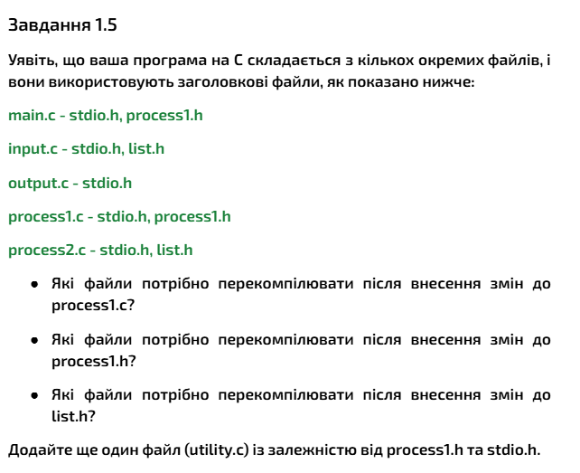
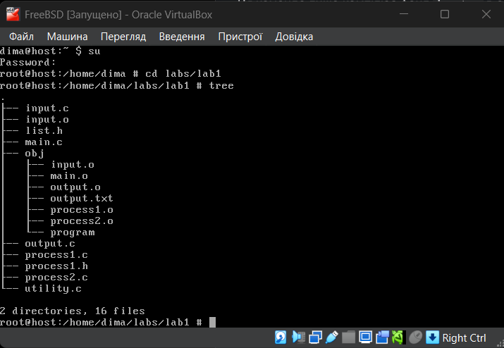
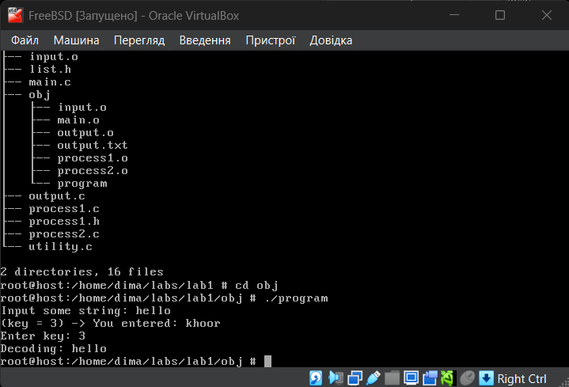
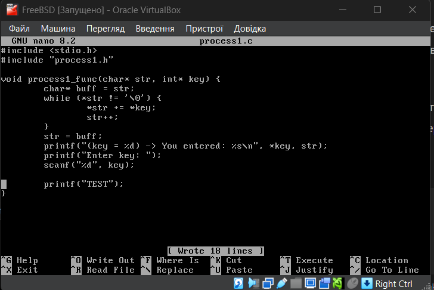
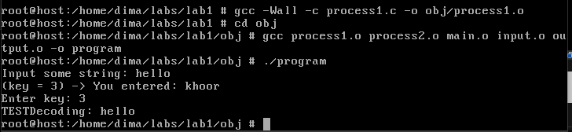

# Лабораторна робота №1
## Завдання 1.5
Після встановлення VirtualBox та FreeBSD, додатково я встановив пакети nano (редактор коду), tree (для зручного перегляду папок та файлів) та компілятор gcc.  
Для вирішення завдання (рисунок 1) я вирішив, що було б непогано зробити імітацію якоїсь невеликої програми з цими файлами для перевірки моїх відповідей. Ця структура мені нагадала минулий рік, а саме лабораторна (5 чи 6), в якій у нас було шифрування та дешифрування. Нехай наша програма буде шифром Цезаря, де input.c - файл, що буде містити реалізацію функції для вводу тексту, а output.c - для виводу в файл, файли process1.c та process2.c - для шифрування та дешифрування відповідно.   

  

Рисунок 1 - завдання відповідно до варіанту
 
Після компіляції файлів маємо наступну файлову структуру (рисунок 2):  

  

Рисунок 2 - структура папок та файлів

 
Давайте протестуємо програму (рисунок 3):  

  

Рисунок 3 - тестування програми

  
Як бачимо програма успішно працює. Тепер, відповідаючи на перше питання, спочатку мені здалося, що після внесення змін до process1.c, скомпілювати потрібно буде два файли - process1.c та main.c, але на практиці виявилося, що достатньо скомпілювати лише одни файл - process1.c. Хибне уявлення про це було спричинено тим, що я чомусь забувся, що main.c містить тільки виклик самої функції а не її реалізацію, яка як раз знаходилась у process1.c (рисунок 4). Ось що у мене вийшло:  

  

Рисунок 4 - внесення змін до process1.c
 
Ось тут були внесені зміни, а саме я додав строку, яка просто виводить "TEST" (рисунок 4). Тепер компілюємо цей файл (рисунок 5):  

  

Рисунок 5 - компіляція та повторний запуск програми

 

> Варто підкреслити, що якщо внесені зміни до файлу - це не просто зміна реалізації функції (рисунок 4), а, наприклад, повне її видалення, то компіляція пройде успішно, а от лінкер уже видасть помилку про те, що він не може знайти реалізацію цієї функції. Цим я хочу сказати, що не будь-які зміни можна внести з подальшою перекомпіляцією потрібних файлів для коректної роботи програми, тобто є виключення і за цим потрібно слідкувати.

 
Оскільки завдання передбачає компіляцію та лінкування окермо, то важливою приміткою тут буде строка:  

> gcc -Wall -c process1.c -o obj/process1.o

Тут для себе я дізнався про новий флажок -с, який каже компілятору скомпілювати файл, але не лінкувати об'єктні файли в програму, оскільки в іншому разі буде помилка, бо лінкер не зможе знайти точку входу в програму - функцію main(). 
Як бачимо, **компіляція одного файлу process1.c, після внесення до нього змін, та подальше об'єднання всіх об'єктних файлів в програму достатньо для того, щоб побачити внесені зміни.**
  
Тепер друге запитання. Воно має таку ж природу, як і третє завдання. Нас запитують: які файли треба перекомпілювати після внесення змін до заголовкових файлів. В кінці завдання потрібно також додати файл utility.c із залежністю від process1.h та stdio.h - це вже було зроблено (рисунок 2).

> Примітка: тут я задався питанням, а звідки програма бере файл stdio.h. Наскільки я зрозумів, при встановленні компілятора, також встановлюються і файли стандартної бібліотеки, але на парі ми розглядали операційну систему FreeBSD, в якій уже знаходились ці бібліотеки, і виходить, що компілятор використовує саме їх. 

Отже, відповідаючи на два останніх питання, **компілювати потрібно тільки файли, які використовують ці заголовкові файли (логічно, бо заголовкові файли не компілюються, а просто використовуються в інших файлах), тобто, якщо внесені зміни до process1.c, то, в нашому випадку, перекомпільовувати потрібно main.c, process1.c та utility.c, а якщо зміни були внесені до файлу list.h, то перекомпільовувати потрібно файли input.c та process2.c.**
  

## Висновок

Отже якщо були внесені зміни до файлів або до хедерів, то перекомпільовувати потрібно тільки ті файли, які мають залежності від файлів, в які ми внесли зміни, найважливіше і найважкіше тут - це правильно зрозуміти що від чого залежить.
