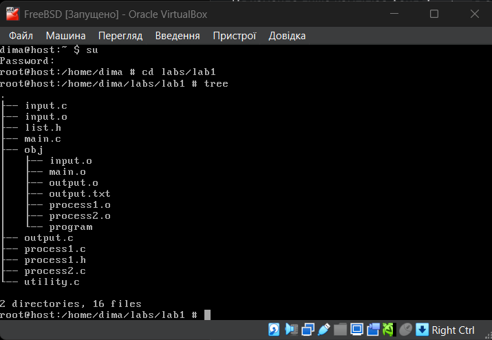
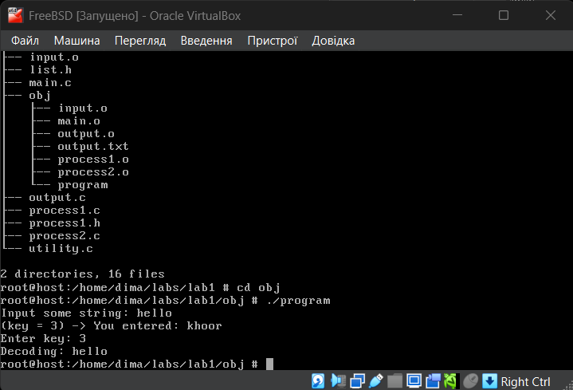
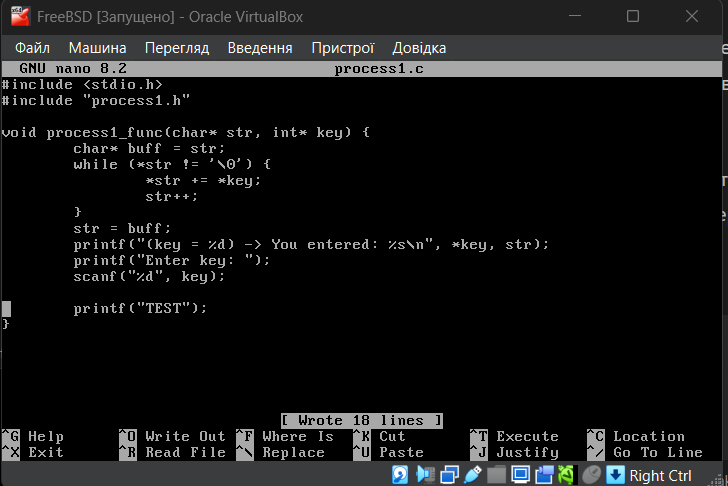
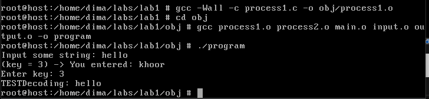

# Лабораторна робота №1
## Завдання 1.5
Після встановлення VirtualBox та FreeBSD, додатково я встановив пакети nano (редактор коду), tree (для зручного перегляду папок та файлів) та компілятор gcc.  
Для вирішення завдання я вирішив, що було б непогано зробити імітацію якоїсь невеликої програми з цими файлами для перевірки моїх відповідей. Ця структура мені нагадала минулий рік, а саме лабораторна (5 чи 6), в якій у нас було шифрування та дешифрування. Нехай наша програма буде шифром Цезаря, де input.c - файл, що буде містити реалізацію функції для вводу тексту, а output.c - для виводу в файл, файли process1.c та process2.c - для шифрування та дешифрування відповідно. Після компіляції файлів маємо наступну файлову структуру:  
  
Давайте протестуємо програму: 
  
Як бачимо програма успішно працює. Тепер, відповідаючи на перше питання, спочатку мені здалося, що після внесення змін до process1.c, скомпілювати потрібно буде два файли - process1.c та main.c, але на практиці виявилося, що достатньо скомпілювати лише одни файл - process1.c. Хибне уявлення про це було спричинено тим, що я чомусь забувся, що main.c містить тільки виклик самої функції а не її реалізацію, яка як раз знаходилась у process1.c. Ось що у мене вийшло:  
  
Ось тут ми були внесені зміни, а саме я додав строку, яка просто виводить "TEST". Тепер компілюємо цей файл:  
  

