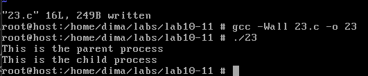
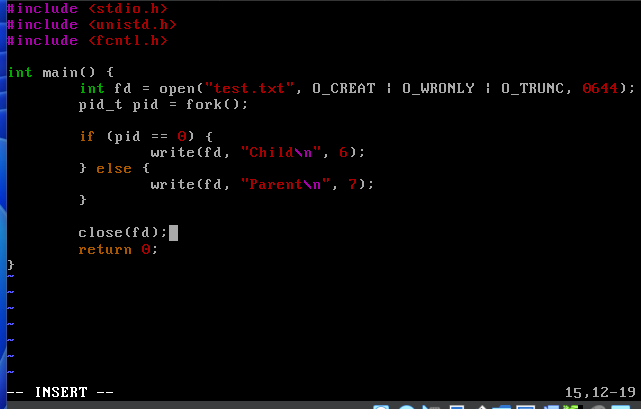
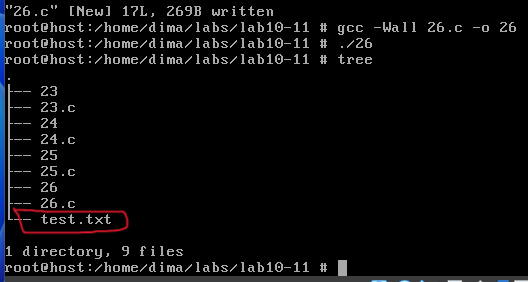

# 
Лабораторна робота №10-11

З теоретичного матеріалу стало зрозуміло як працює fork() (не дивлячись на те, що він був у восьмій лабораторній роботі): 
<ul>
    <li>fork() створює копію поточного процесу (батьківського).</li>
    <li>Обидва процеси (батьківський і дочірній) продовжують виконання з</li>
    <li>Вони можуть бути розрізнені за значенням, яке повертає fork():</li>
    <ul>
        <li>0 — ви в дочірньому процесі</li>
        <li>> 0 — ви в батьківському (значення — PID дочірнього)</li>
        <li>< 0 — помилка</li>
    </ul>
</ul>
Для закріплення цих знань, пройдемось по прикладам з лабораторної роботи. Першим прикладом іде 2.3. Використання системного виклику fork(). Перепишемо код, скомпілюємо та запустимо його (рисунок 1, 2).

    

    Рисунок 1 - Код програми

 

    

    Рисунок 2 - Компіляція та запуск

 

Бачимо вивід про батьківський та дочірній процеси.  Тепер 2.4. Експеримент: імітація роботи в процесах (рисунок 3, 4).

    

    Рисунок 3 - Код програми

 

    

    Рисунок 4 - Компіляція та запуск

 

Порядок виводу є абсолютно нормальним і очікуваним при використанні fork() — це результат одночасного (паралельного) виконання двох процесів, які незалежні одне від одного.  Тепер 2.5. Копіювання даних при fork (рисуснок 5, 6).

    

    Рисунок 5 - Код програми

 

    

    Рисунок 6 - Компіляція та запуск

 

Пам’ять копіюється, і значення змінної counter розділене. Змінна counter не є спільною — вона просто копіюється в дочірній процес. Після цього обидва процеси мають незалежні копії памʼяті. Зміна в одному не впливає на інший. Тому бачимо саме такий вивід.  Тепер 2.6. Процеси та відкриті файли (рисунок 7, 8).

 

    

    Рисунок 7 - Код програми

 

    

    Рисунок 8 - Компіляція та запуск

 

    

    Рисунок 9 - Вміст файлу test.txt

 

Файлові дескриптори успадковуються, але мають спільну таблицю позицій у файлі.  Тепер 2.7. Проєкт: Dumb Shell (DumbSH) та 2.8. Запуск dumbsh (рисунок 10, 11, 12, 13, 14).

 

    

    Рисунок 10 - Код програми

 

    

    Рисунок 11 - Компіляція (бачимо попередженян від компілятора)

 

Вирішенням стало підключення заголовочного файлу. 
<a href = "https://man7.org/linux/man-pages/man2/wait.2.html">https://man7.org/linux/man-pages/man2/wait.2.html</a>

 

    

    Рисунок 12 - manual page wait(2) на man7.org

 

    

    Рисунок 13 - Виправлений код програми з підключеним sys/wait.h

 

    

    Рисунок 14 - Компіляція з подільшим запуском та тестуванням

 

Тепер 2.9. API wait — деталі (рисунок 15, 16).
<ul>
    <li>wait() — чекає на будь-який дочірній процес</li>
    <li>waitpid(pid, ...) — чекає на конкретний PID</li>
    <li>WNOHANG — не блокує, якщо дитина ще не завершилась</li>
</ul>

 

    

    Рисунок 15 - Доповнення до коду

 

    

    Рисунок 16 - Результат виконання після доповнення

 

Доповнення дозволяє аналізувати результат виконання команд точніше. Це дозволить бачити, з яким кодом завершилась команда. Наприклад, 0 — успішно, інші — з помилкою.  
Далі 2.10. Fork Bomb та створення декількох дітей. fork() може бути використаний не лише конструктивно. При безконтрольному його використанні можна створити так звану fork bomb
— нескінченне створення процесів, що швидко вичерпує ресурси системи.
Це показує важливість обмежень (ulimit), а також контролю над кількістю
створюваних дочірніх процесів у навчальних і реальних програмах. Нам надають приклад з такою бомобою: :(){ :|:& };: і про це знайшов наступну інформацію:

<a href = "https://askubuntu.com/questions/777562/what-does-do">https://askubuntu.com/questions/777562/what-does-do</a> 
Тут написано приблизно те саме, що і в лекції - функція терміналу, яка рекурсивно викликає саму себе і створює нескінченну кількість процесів.  
Тепер Приклад створення кількох дітей (рисунок 17, 18).

 

    

    Рисунок 17 - Код програми

 

    

    Рисунок 18 - Компіляція та виконання

 

У циклі for, який виконується тричі, викликається fork(). Цей виклик створює новий процес. Якщо fork() повертає 0, то ми знаходимося всередині дочірнього процесу — він виводить повідомлення на екран Child i, де i — поточний індекс циклу, і одразу завершується викликом exit(0), щоб не породжувати нових процесів у наступних ітераціях. У батьківському процесі fork() повертає PID дочірнього процесу, і цикл триває далі. Після завершення циклу батьківський процес переходить до циклу while (wait(NULL) > 0);, який блокує виконання до тих пір, поки не завершаться всі дочірні процеси. wait() повертає PID завершеного процесу, а коли більше немає дочірніх — повертає -1, і цикл завершується.  
Можемо підвести підсумки: 
<ul>
    <li>Варіації wait:</li>
    <ul>
        <li>wait(NULL); // будь-який дочірній</li>
        <li>waitpid(-1, &status, 0); // еквівалент wait</li>
        <li>waitpid(pid, &status, 0); // конкретний процес</li>
        <li>waitpid(pid, &status, WNOHANG); // не блокує</li>
    </ul>
    <li>fork() копіює:</li>
    <ul>
        <li>пам'ять</li>
        <li>файлові дескриптори</li>
        <li>сигнали</li>
    </ul>
    <li>fork() НЕ копіює:</li>
    <ul>
        <li> потоки</li>
        <li>файлові блокування</li>
        <li>pthread-mutex</li>
    </ul>
</ul>

 

## 
Варіант 5

 

> 5. Зробіть програму, в якій дочірній процес завершується з певним
кодом (exit(7), наприклад), а батьківський читає цей код через wait()
та виводить його.

 

Напишемо відповідний код (рисунок 19, 20), спочатку викликається fork() з перевіркою на успішність виконання функції (якщо менше за 0). Якщо fork() повертає нуль — ми знаходимося в дочірньому процесі. У цьому випадку виконується повідомлення про вихід exit(7). Якщо ж fork() повертає більше нуля — ми знаходимося у батьківському процесі, і отримане значення — це PID дочірнього процесу. Батьківський процес викликає wait(&status) — це функція, яка зупиняє виконання батька, поки не завершиться дочірній процес. Після цього WIFEXITED(status) перевіряє, чи завершився дочірній процес нормально. Якщо так, то він дозволяє отримати код завершення, з яким завершився дочірній процес і ми виводимо про це повідомлення (якщо дочірній процес завершився некоректно, то теж про це виводиться помилка).

    

    Рисунок 19 - Код програми

 

    

    Рисунок 20 - Компіляція та виконання

 

