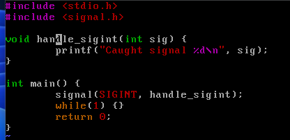
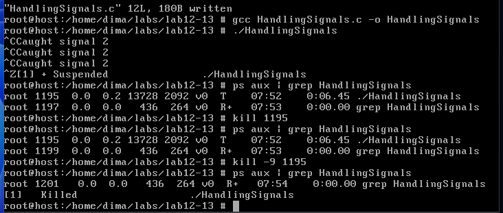
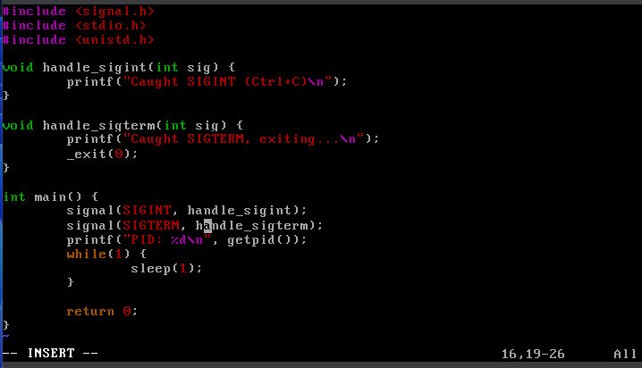
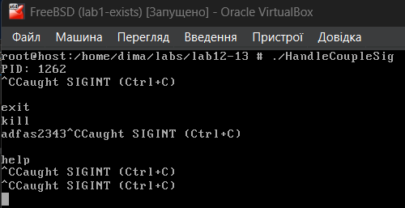

# 
Лабораторна робота №12-13

## 
Signaling

 

<strong>Handling Signals</strong> (рисунок 1, 2).

    

    Рисунок 1 - Код програми

 

    

    Рисунок 2 - Компіляція та виконання

 

Як бачимо, тут обробляється SIGINT — натискання Ctrl+C не завершить програму, а виводить повідомлення:

> Caught signal 2

Щоб вийти можна натиснути Ctrl+Z, але в чому різниця ? Ця комбінація клавіш надсилає SIGSTOP і призупиняє виконання поточного процесу. Але процес переходить на виконання у фоновому режимі і для повного завершення потрібно ще написати:

> kill -9 PID

<a href="https://askubuntu.com/questions/510811/what-is-the-difference-between-ctrl-z-and-ctrl-c-in-the-terminal">https://askubuntu.com/questions/510811/what-is-the-difference-between-ctrl-z-and-ctrl-c-in-the-terminal</a>  

<b>
A Simple C Program that Handles a Couple of Signals
</b>
 (рисунок 3, 4).

    

    Рисунок 3 - 

 

    

    Рисунок 4 - 

 

??????

<!-- 

 

## 
Варіант 5

 

> 5. Напишіть багатопоточну програму, яка виконує критичну обчислювальну задачу, і у
випадку SIGSEGV відновлюється з останньої збереженої контрольної точки.

 

    ???????????

    

    Рисунок ? - 

 

    ??????????

 -->

