

# 
Лабораторна робота №12-13

## 
Signaling

 

<b>Handling Signals</b> (рисунок 1, 2).

    

    Рисунок 1 - Код програми

 

    

    Рисунок 2 - Компіляція та виконання

 

Як бачимо, тут обробляється SIGINT — натискання Ctrl+C не завершить програму, а виводить повідомлення:

> Caught signal 2

Щоб вийти можна натиснути Ctrl+Z, але в чому різниця ? Ця комбінація клавіш надсилає SIGSTOP і призупиняє виконання поточного процесу. Але процес переходить на виконання у фоновому режимі і для повного завершення потрібно ще написати:

> kill -9 PID

<a href="https://askubuntu.com/questions/510811/what-is-the-difference-between-ctrl-z-and-ctrl-c-in-the-terminal">https://askubuntu.com/questions/510811/what-is-the-difference-between-ctrl-z-and-ctrl-c-in-the-terminal</a>  

<b>A Simple C Program that Handles a Couple of Signals</b> (рисунок 3, 4).

    

    Рисунок 3 - Код програми

 

    

    Рисунок 4 - Компіляція та запуск

 

В результаті бачимо, що процес виводить свій PID, реагує на SIGINT повідомлення у разі Ctrl + C. Але як надіслати SIGTERM для завершення виконання процесу ? Про це знайшов наступну інформацію: <a href="https://www.ibm.com/docs/en/zos/2.4.0?topic=descriptions-kill-end-process-job-send-it-signal">https://www.ibm.com/docs/en/zos/2.4.0?topic=descriptions-kill-end-process-job-send-it-signal</a>. Тобто комбінації клавіш для цього немає, а щоб надіслати такий сигнал, потрібно в консолі FreeBSD написати

> kill -TERM PID

Але щоб це зробити при виконання процесу, потрібен інший термінал <a href="https://docs-archive.freebsd.org/doc/12.2-RELEASE/usr/local/share/doc/freebsd/en/books/handbook/consoles.html#:~:text=The%20key%20combinations%20Alt%2BF1,ttyv2%20)%2C%20and%20so%20on.">https://docs-archive.freebsd.org/doc/12.2-RELEASE/usr/local/share/doc/freebsd/en/books/handbook/consoles.html#:~:text=The%20key%20combinations%20Alt%2BF1,ttyv2%20)%2C%20and%20so%20on</a>, але жодна з комбінацій у мене не спрацювала, як би не намагався, як би не редагував файл /etc/ttys, тому встановив пакет tmux <a href="https://man.freebsd.org/cgi/man.cgi?tmux">https://man.freebsd.org/cgi/man.cgi?tmux</a>. Тут для відкриття нової консолі потрібно натиснути Ctrl + B і потім клавішу N, цю ж комбінацію можна виконати для повернення в перший термінал. З цим пакетом все запрацювало (рисунок 5, 6).

    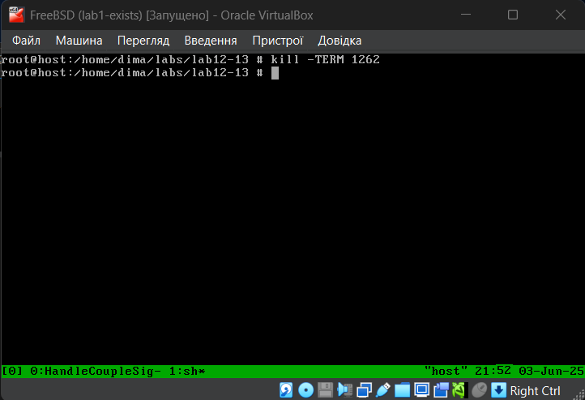

    Рисунок 5 - Відкриття нового терміналу та відправлення сигналу SIGTERM

 

    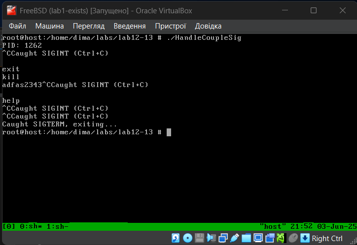

    Рисунок 6 - Результат після відправлення сигналу SIGTERM

  

<b> Masking Signals</b> (рисунок 7, 8).

    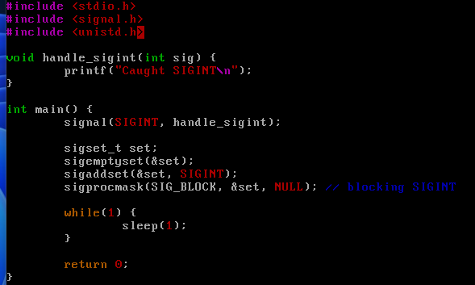

    Рисунок 7 - Код програми

 

    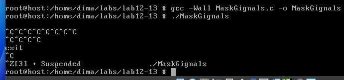

    Рисунок 8 - Компіляція та виконання процесу

 

Як бачимо, тепер комбінація Ctrl + C не працює, оскільки SIGINT заблокований.   
<b>Sigaction Flags</b> (рисунок 9, 10).

    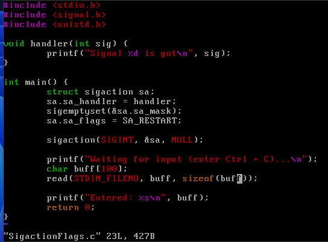

    Рисунок 9 - Компіляція та виконання процесу

 

    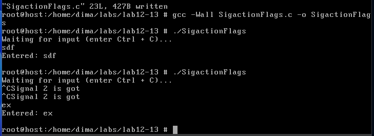

    Рисунок 10 - Компіляція та виконання процесу

 

Функція sigaction() — більш контрольований спосіб установки обробників. Дає змогу встановити маску сигналів під час обробки та вказати прапори (flags), що змінюють поведінку.   
<b>No Zombies</b> (рисунок 11, 12).

    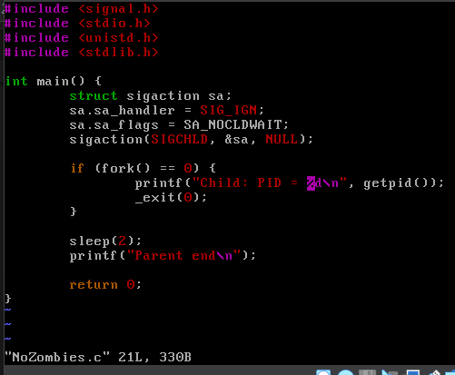

    Рисунок 11 - Код програми

 

    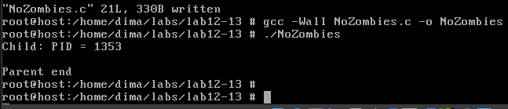

    Рисунок 12 - Компіляція та виконання

 

Коли дочірній процес завершується, але батько не викликає wait(), дочірній стає зомбі (process in zombie state). Щоб уникнути зомбі, потрібно обробити сигнал SIGCHLD з SA_NOCLDWAIT, або викликати waitpid() або wait() у батьківському процесі.
   
<b>Different Approaches to Handling Signals at High Volume</b>. 
При великій кількості сигналів (наприклад, сотні SIGUSR1 за секунду), можуть виникнути проблеми, наприклад, сигнали не буферизуються — один тип сигналу може бути доставлений один раз, навіть якщо він був надісланий кілька разів, або можливі втрати сигналів.  Підходи до масштабної обробки:
<ul align="justify">
    <li>signalfd() — перетворює сигнал на файловий дескриптор (Linux-specific)</li>
    <li>sigqueue() — надсилає сигнал з додатковими даними (union sigval).
</li>
    <li>RT-сигнали (SIGRTMIN..SIGRTMAX) — можуть бути черговими (queued) і зберігають
порядок.
</li>
    <li>Перехід до event-based моделей (наприклад, epoll/kqueue у поєднанні з signalfd).</li>
    <li>Сигнали — потужний, але потенційно небезпечний інструмент IPC.</li>
    <li>Важливо правильно маскувати сигнали, обирати безпечні функції та розуміти
обмеження.
</li>
    <li>У сучасних системах краще уникати сигналів для масового оповіщення —
використовуються черги, дескриптори, події.
</li>
</ul>
  
<b>Gracefully Handling Process Crashes</b> (рисунок 13, 14).

    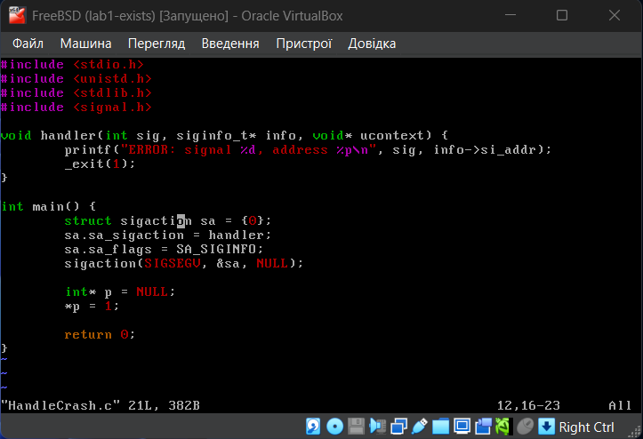

    Рисунок 13 - Код програми

 

    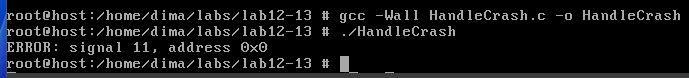

    Рисунок 14 - Компіляція та виконання

 

Процеси можуть аварійно завершуватися через помилки, такі як: сегментаційна помилка (SIGSEGV), ділення на нуль (SIGFPE), незаконна інструкція (SIGILL), порушення доступу до пам’яті (SIGBUS). Щоб програма не просто впала, а зробила це контрольовано, наприклад: зберегти лог або дамп регістрів, очистити ресурси (файли, сокети, пам’ять), потрібно встановити обробник для цих сигналів та використовувати sigaction() з прапором SA_SIGINFO для отримання додаткових даних.   
<b>Trapping and Extracting Information from a Crash </b>(рисунок 15, 16).

    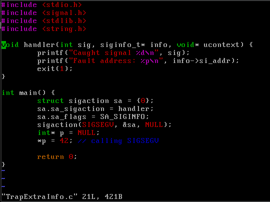

    Рисунок 15 - Код програми

 

    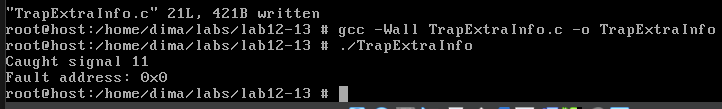

    Рисунок 16 - Компіляція та виконання

 

Обробник сигналу з SA_SIGINFO отримує додаткову інформацію через siginfo_t.
   
<b>Register Dumping</b> (рисунок 17, 18).

    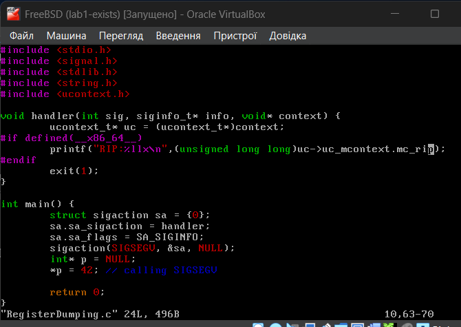

    Рисунок 17 - Код програми

 

    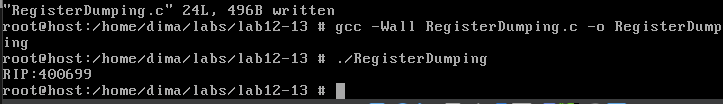

    Рисунок 18 - Компіляція та виконання

 

Тут замість uc_mcontext.gregs[REG_RIP] використовується uc_mcontext.mc_rip (<a href="https://lists.freebsd.org/pipermail/freebsd-emulation/2009-October/006950.html">https://lists.freebsd.org/pipermail/freebsd-emulation/2009-October/006950.html</a>)   
<b> Sleeping Correctly</b> (рисунок 19, 20).

    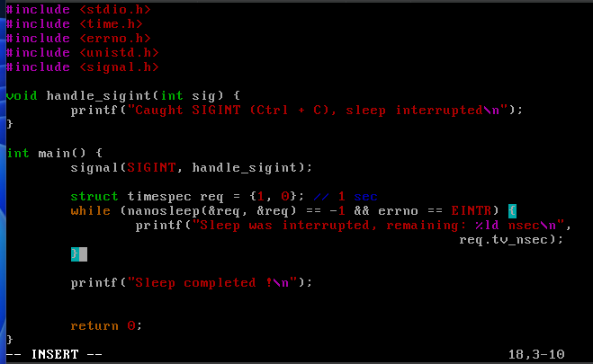

    Рисунок 19 - Код програми

 

    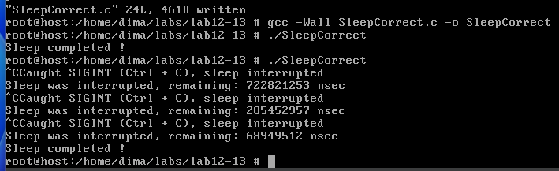

    Рисунок 20 - Компіляція та виконання

 

Звичайні функції сну (sleep, usleep, nanosleep) можуть бути перервані сигналами. Щоб вирішити це, потрібно або повторно викликати nanosleep() з оновленим залишком (наш випадок), або використовувати sigsuspend().   
<b>Real-Time Signals</b> (рисунок 21, 22). 

    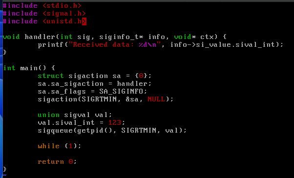

    Рисунок 21 - Код програми

 

    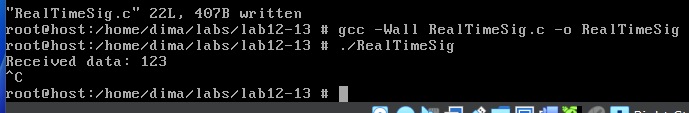

    Рисунок 22 - Компіляція та виконання

 

Тут реєструється обробник для SIGRTMIN, надсилатьсяє цей сигнал сам собі через sigqueue() і обробник друкує значення, яке було передано.   
<b>Sending Signals</b>. 
Сигнали можна надсилати з процесу або з shell: 
Shell: 

> `kill -SIGUSR1 <pid>` 

C API: 

> kill(pid, SIGTERM);

> sigqueue(pid, SIGUSR1, val); // з даними

Ми вже робили подібне у попередніх прикладах і з терміналу, і у коді.   
<b>A Small Publisher-Subscriber Type of Application</b> (рисунок 23, 24, 25, 26, 27, 28).

    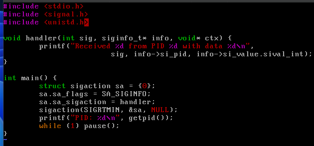

    Рисунок 23 - Код Sub.c

 

    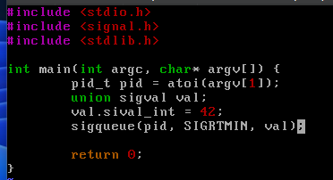

    Рисунок 24 - Код Pub.c

 

    

    Рисунок 25 - Запускаємо tmux щоб увійти в режим декількох терміналів

 

    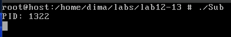

    Рисунок 26 - Запускаємо ./Sub в терміналі 1

 

    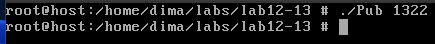

    Рисунок 27 - Запуск ./Pub 1322 в терміналі 2

 

    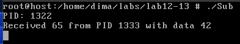

    Рисунок 28 - Повернення в термінал 2

 

У цьому прикладі підписник (subscriber) очікує сигнали, а видавець (publisher) надсилає RT-сигнали з payload.
   
<b>Alternative Signal-Handling Techniques</b>. 
Замість signal()/sigaction() використовують: 
signalfd() — Linux-specific API, перетворює сигнал у файловий дескриптор;
 eventfd()/epoll() — для інтеграції з event loop;
 Threads + sigwaitinfo() — синхронне очікування сигналів у спеціальному потоці.

<a href="https://man.freebsd.org/cgi/man.cgi query=signalfd4&sektion=2&manpath=CentOS+6.0">https://man.freebsd.org/cgi/man.cgi?query=signalfd4&sektion=2&manpath=CentOS+6.0</a>

Тут пишеться про signalfd, проте у мене його немає (рисунок 29), оскільки це саме Linux-specific API.

    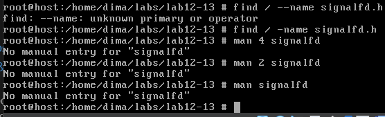

    Рисунок 29 - Перевірка signalfd.h

 

 
<b>The sigwaitinfo and the sigtimedwait System Calls</b>

Дозволяють синхронно очікувати сигнал і отримати про нього дані (подібно до обробника, але не асинхронно) (рисунок 30, 31, 32, 33).
 

    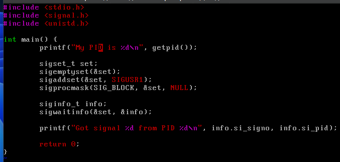

    Рисунок 30 - Код програми

 

    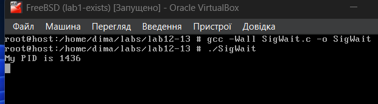

    Рисунок 31 - Компіляція та запуск в першому терміналі

 

    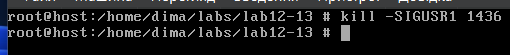

    Рисунок 32 - Відправла сигналу з іншого терміналу

 

    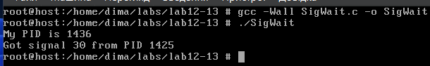

    Рисунок 33 - Отримання сигналу

 

Переваги:
 + Немає асинхронного виклику
 + Безпечніше працювати з ресурсами

  

<b>Source Code (Збірка компонентів)</b> (рисунок 34, 35, 36, 37, 38). 

    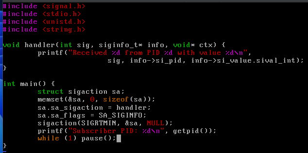

    Рисунок 34 - Код програми subscriber.c

 

    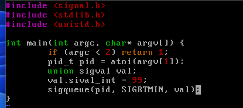

    Рисунок 35 - Код програми publisher.c

 

    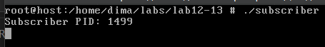

    Рисунок 36 - Компіляція та запуск subscriber.c

 

    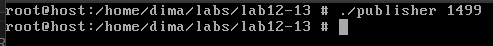

    Рисунок 37 - Запуск publisher

 

    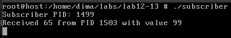

    Рисунок 38 - Результат запуску publisher

 

 

## 
Варіант 5

 

> 5. Напишіть багатопоточну програму, яка виконує критичну обчислювальну задачу, і у
випадку SIGSEGV відновлюється з останньої збереженої контрольної точки.

 

    З приводу багатопоточності знайшов наступну інформацію: <a href="https://stackoverflow.com/questions/71619808/need-help-on-multi-threaded-programming-with-c-on-linux">https://stackoverflow.com/questions/71619808/need-help-on-multi-threaded-programming-with-c-on-linux</a>. Тому для цього завдання буду використовувати pthread (<a href="https://man.freebsd.org/cgi/man.cgi?pthread(3)">https://man.freebsd.org/cgi/man.cgi?pthread(3)</a>). 
    Логіка програми буде наступною: у кожному потоці є важлива обчислювальна функція, потік періодично викликає sigsetjmp(), який зберігає стан (контрольну точку), і якщо виникає сегментаційна помилка (SIGSEGV), обробник SIGSEGV викликає siglongjmp(), який, в свою чергу, повертає виконання до останньої збереженої точки (рисунок 39, 40).

    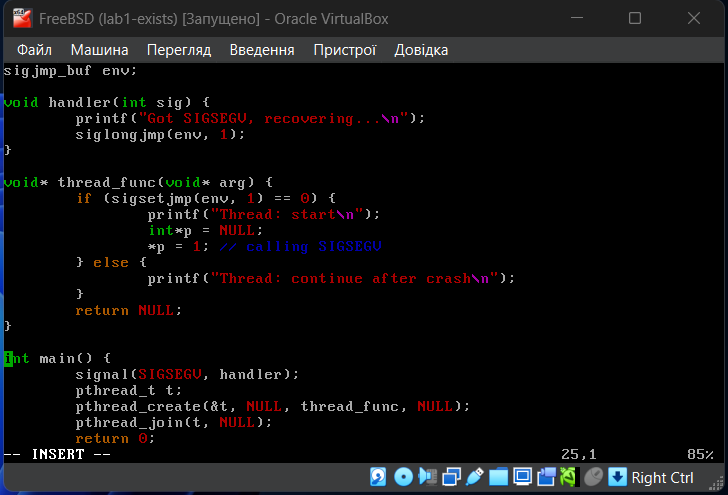

    Рисунок 39 - Код програми

 

    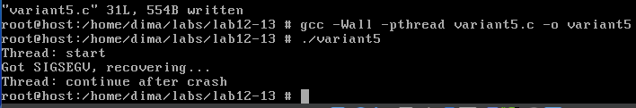

    Рисунок 40 - Компіляція та запуск

 
 

