

# 
Лабораторна робота №14

## 
Timers

 

alarm() — викликає сигнал SIGALRM через задану кількість секунд.
  
На базі setitimer() або alarm() можна реалізувати простий цифровий
годинник у CLI (рисунок 1, 2):
 1. Використовуємо SIGALRM, щоб щосекунди оновлювати екран;
 2. В обробнику сигналу малюємо години:хвилини:секунди;
 3. Обробку можна реалізувати через write() (вона reentrant-безпечна).

    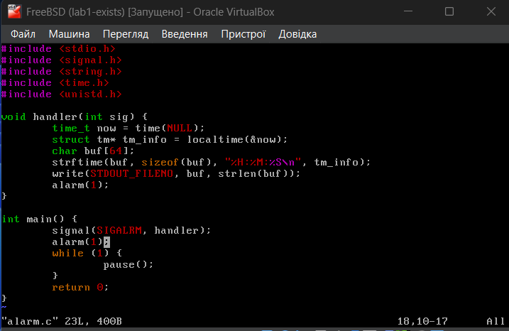

    Рисунок 1 - Код програми

 

    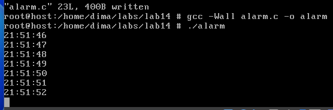

    Рисунок 2 - Компіляція та запуск

 

Але існують певні недоліки такого підходу:
 1. Працює лише один таймер alarm() на процес;
 2. Неможливо обробляти інші події або інтегрувати з epoll/select;
 3. Застарілий API, не підходить для складних або багатопоточних застосунків.
  
Сучасна альтернатива — POSIX timers, які дають змогу:
 1. Створювати кілька таймерів;
 2. Працювати з точністю до наносекунд;
 3. Отримувати події у вигляді сигналів або дескрипторів;
 4. Інтегрувати таймери в epoll (через timerfd_create — розширення Linux).
  
Example program – POSIX interval timers (рисунок 3, 4).
 

    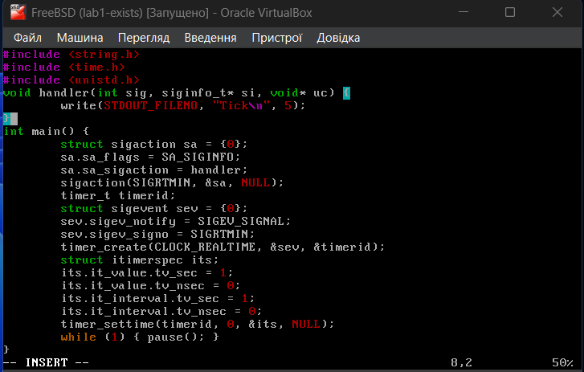

    Рисунок 3 - Код програми

 

    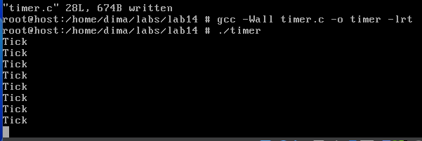

    Рисунок 4 - Компіляція та запуск

 

Основні функції:

| Функція  | Призначення |
| ------------- | ------------- |
| timer_create() | створити таймер  |
| timer_settime() | запустити/оновити таймер  |
| timer_gettime() | дізнатись залишок часу |
| timer_delete() | знищити таймер |

 Структури:

+ struct sigevent - описує, як система повідомляє про подію (сигнал чи потік);
+ struct itimerspec - містить:
  + it_value - коли таймер спацює вперше;
  + it_interval - інтервал повторення (0 для одноразового).

 

## 
Варіант 5

 

> 5. Дослідіть, як поводиться таймер у стані sleep/suspend (через CLOCK_MONOTONIC vs CLOCK_REALTIME).

 

<a href="https://stackoverflow.com/questions/3523442/difference-between-clock-realtime-and-clock-monotonic">https://stackoverflow.com/questions/3523442/difference-between-clock-realtime-and-clock-monotonic</a>

CLOCK_REALTIME — це системний реальний час, який відображає поточну дату та час, встановлені в операційній системі. Цей час можна змінювати вручну або автоматично через мережеву синхронізацію (наприклад, NTP). Через це CLOCK_REALTIME може "стрибати" вперед або назад, якщо системний годинник коригується. У випадку сну або збереження стану віртуальної машини, після пробудження час CLOCK_REALTIME може різко змінитись відповідно до реального календарного часу. Цей таймер підходить для задач, де важливо знати саме дату і час, наприклад, для журналювання або відображення поточного часу.  
CLOCK_MONOTONIC — це монотонний таймер, який відраховує час, що минув від запуску системи і не залежить від змін системного годинника. Він ніколи не повертається назад і не коригується при переході в сон, збереженні стану віртуальної машини або зміні системного часу. Завдяки цьому CLOCK_MONOTONIC ідеально підходить для вимірювання інтервалів часу, таймерів і відліку затримок, бо дає стабільний і безперервний відлік, який не впливає на зовнішні зміни часу.
  
Це різниця в теорії, далі йдуть мої марні спроби показати це на практиці...
  

<a href="https://wiki.freebsd.org/SuspendResume">https://wiki.freebsd.org/SuspendResume</a>

Проблема в тому, що у VirtualBox на FreeBSD не існує такого стану, як suspend/sleep (рисунок 5), а зміна стану у VirtualBox на Pause або Save State не дають потрібного ефекту, тобто різниці між CLOCK_MONOTONIC та CLOCK_REALTIME в такому випадку немає.

    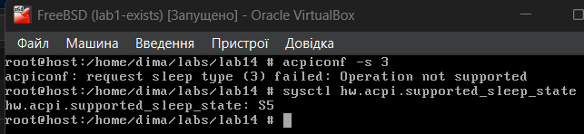

    Рисунок 5 - Перевірка режимів системи (sleep states)

 

Різниця між станами полягає в наступному (<a href="https://superuser.com/questions/71835/what-is-the-difference-between-these-four-sleep-states">https://superuser.com/questions/71835/what-is-the-difference-between-these-four-sleep-states</a>):

> S0 - On / Working The computer is powered up. If supported, power conservation is handled by each device.

> S1 - Sleep CPU is stopped. RAM maintains power. Everything else is off, or in low power mode.

> S2 - Sleep CPU has no power. RAM maintains power. Everything else is off, or in low power mode.

> S3 - Standby CPU has no power. RAM maintains power, refreshes slowly. Power supply reduces power. This level might be referred to as “Save to RAM.” Windows enters this level when in standby.

> S4 - Hibernate Power to most hardware is shut off. Any files in memory are saved to the hard disk in a temporary file. If configured, the NIC will remain on for WOL or AoL. This level is also known as “Save to disk.”

> S5 - Off Everything is off. No files are saved. If configured, the NIC will maintain power to listen for WOL (magic) packets. This is known as a shutdown. 

 

Нам потрібен третій режим (<a href="https://wiki.freebsd.org/SuspendResume">https://wiki.freebsd.org/SuspendResume</a>). 

І виходить, що у мене є тільки увімкнений стан та S5 - стан вимкнення. Тому для цього встановимо QEMU (у мене виникли проблеми при встановленні VMWare, який має потрібні режими) -  вільна програма з відкритим початковим кодом для емуляції апаратного забезпечення різних платформ. QEMU дозволяє запустити програму, зібрану для однієї апаратної платформи, на системі із зовсім іншою архітектурою, наприклад, виконати застосунок для ARM на x86-сумісному ПК. Після завантаження iso-файлу, встановлення віртуальної ОС та усіх необхідних пакетів (gcc, vim, tree), потрібно перевірити режими. Вона має наступні стани (рисунок 6).  

    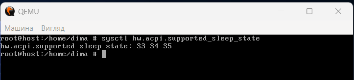

    Рисунок 6 - Перевірка режимів на FreeBSD у QEMU

 

Ремарка: 

у ході виконання завдання, доводилось часто вмикати та вимикати віртуальну ОС, оскільки QEMU працює через термінал (існує графічна оболонка AQEMU, але мені захотілось працювати в терміналі для різноманіття, оскільки до цього весь час був VirtualBox, який мав свій графічний інтерфейс). Тому був написаний невеликий .bat файл зі скриптом, який запускав ОС (рисунок 7).

    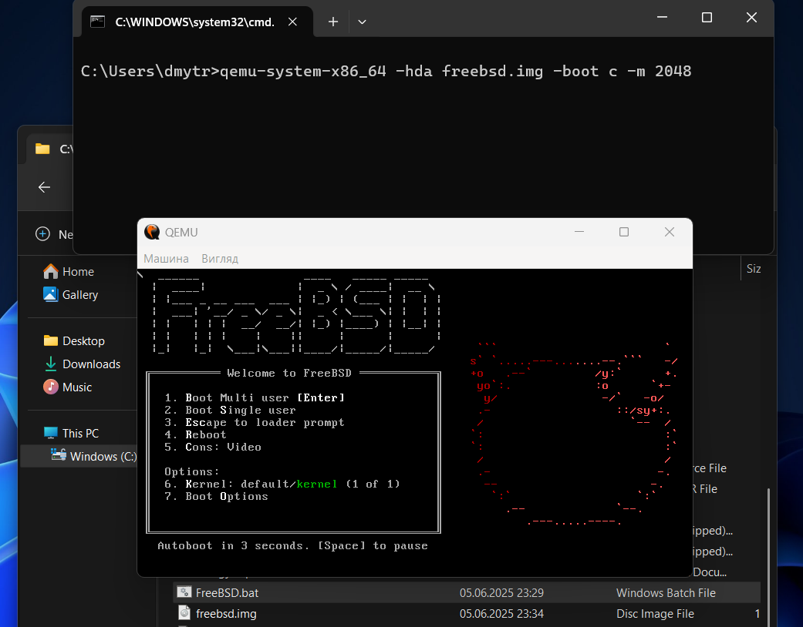

    Рисунок 7 - Створення .bat файлу (скрипт видно в консолі)

 

> qemu-system-x86_64 -hda freebsd.img -boot c -m 2048

Параметри: 
1. -hda - образ диску, створений раніше (freebsd.img)
2. -boot c - завантаження з жорсткого диску
3. -m 2048 - 2 ГБ оперативної пам'яті

Для створення образу диску було попередньо завантажено образ .iso з FreeBSD (FreeBSD-14.2-RELEASE-amd64-disc1.iso) та запуск команди 

> qemu-system-x86_64 -cdrom FreeBSD-13.3-RELEASE-amd64-disc1.iso -hda freebsd.img -boot d -m 2048

Параметри: 
1. -cdrom - ISO файл з FreeBSD
2. -boot d - завантажити з CD (в нашому випадку завантажити систему з ISO) (для встановлення)  

Також в минулій лабораторній (12-13 чи 10-11) у мене були проблеми з кількома терміналами (там для вирішення встановлював окремий пакет tmux), але потім проблема раптово зникла, і спробувавши ще раз, чомусь все запрацювало, тобто через Alt + F1/F2/F3...F8 у мене відкривались відповідні віртуальні термінали ttyv1, ttyv2, ttyv3 ... ttyv8. Це було і на VirtualBox, і на QEMU (тут ніяких пробелм взагалі з цим не було) (рисунок 8).

    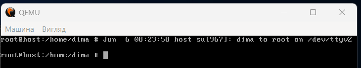

    Рисунок 8 - Віртуальні термінали (вид з ttyv1, де видно дату та час створення ttyv2)

 

Тепер на основі другого прикладу з лекції (Example program – POSIX interval timers) напишемо відповідний код до завдання (рисунок 9).

    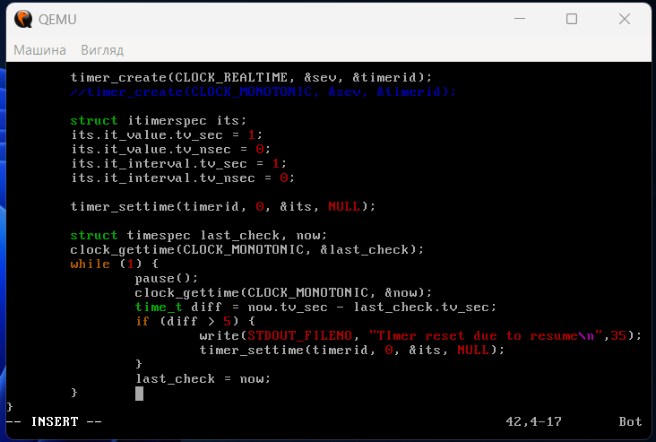

    Рисунок 9 - Основний код програми

 

Цей код  - повна копія прикладу з леції, проте тут було додано до циклу певну перевірку, оскільки таймер глючить після suspend/resume і якщо різниця інтервалів часу при системному clock_gettime() буде більша за 5 секунд, то таймер буде перевстановлюватись через timer_settimer(). Тепер скомпілюємо і запустимо для CLOCK_REALTIME (рисунок 10, 11, 12), і для CLOCK_MONOTONIC (рисунок 13, 14, 15). При компіляції додатково використовуємо прапорець -lrt (при компіляції другого прикладу з леції теж був використаний саме він) для підключення бібліотеки librt, яка містить функції для роботи з таймерами, сигналами, високоточним часом і іншими real-time можливостями POSIX (<a href="https://stackoverflow.com/questions/259784/what-libraries-need-to-be-linked-for-timer-create-timer-settime-and-other-timer">https://stackoverflow.com/questions/259784/what-libraries-need-to-be-linked-for-timer-create-timer-settime-and-other-timer</a>). У ній є реалізації таких функцій як timer_create(), timer_settime(), clock_gettime().

    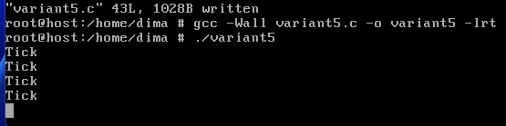

    Рисунок 10 - Компіляція та запуск з CLOCK_REALTIME (вигляд у терміналі ttyv1)

 

    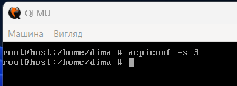

    Рисунок 11 - Переводимо систему у режим сну (вигляд у терміналі ttyv2)

 

    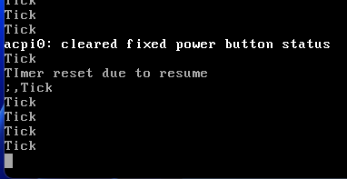

    Рисунок 12 - Результат повернення після сну (вигляд у терміналі ttyv1)

 

    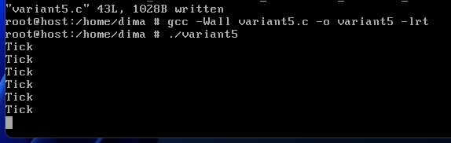

    Рисунок 13 -  Компіляція та запуск з CLOCK_MONOTONIC (вигляд у терміналі ttyv1)

 

    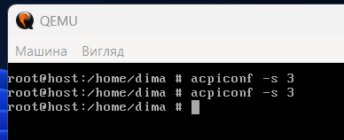

    Рисунок 14 -  Переводимо систему у режим сну (вигляд у терміналі ttyv2)

 

    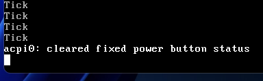

    Рисунок 15 - Результат повернення після сну (вигляд у терміналі ttyv1)

 

Бачимо у результатах, що при CLOCK_REALTIME таймер продовжує працювати, а при CLOCK_MONOTONIC - ні. Наскільки я зрозумів, то реалізація таймерів після повернення зі сну різниться від однієї Unix-подібної ОС до іншої, тому справжня різниця між ними залишається тільки в теорії.

