# Практичне заняття №2

## Завдання 2.1

Для початку дізнаємось архітектуру процесора - вона визначає скільки біт інформації може обробляти процесор за один раз (рисунок 1).

    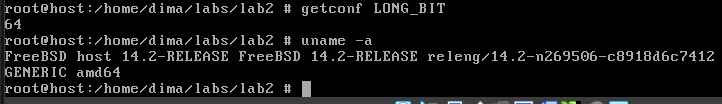

    Рисунок 1 - розрядність системи

 
Бачиомо, що у мене стоїть 64-х розрядна система. В такому випадку усі int у мене будуть займати розмір 64 біта або 8 байтів. time_t - псевдонім, тип даних для представлення часу. В мові C цей псевдонім створюється через typedef і фактичним його типом даних як раз і є цілочисленний тип даних - int. Перевіримо розмір time_t для моєї системи (рисунок 2, 3).

 

    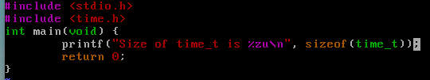

    Рисунок 2 - код для перевірки

 

    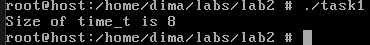

    Рисунок 3 - результат

 
Бачимо, що все сходиться і розмір time_t - 8 байт. Оскільки time_t - час з моменту 1970 року, то, якщо якимось чином цей ноутбук доживе до цього моменту, проблема 2038 року мене не задіне ще найближчі 292 мільярди років, а ось для 32-розрядних процесорів все буде трохи інакше. У 2038 році системний годинник (маю на увазі усі програми, які працюють з часом і використовують time_t) дасть збій і час покаже 1900 рік. Вирішенням цієї пробелми є перехід усіх 32-бітних систем на 64-бітні.

Дослідимо сегменти виконуваного файлу, виконавши команду size, яка виведе інформацію про три основні сегменти: текстовий, даних та BSS (рисунок 4).   

    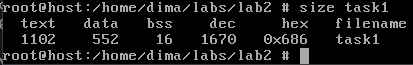

    Рисунок 4 - сегменти виконуваного файлу

 

## Завдання 2.2

Виконаємо пункт 1 (рисунок 5)  

    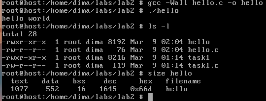

    Рисунок 5 - пункт 1

 

Тепер виконаємо пункт 2 (русунок 6). Тут ми додали оголошення глобального масиву з 1000 int. 

    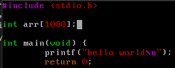

    Рисунок 6 - додавання оголошення глобального масиву

 
Тепер перекомпілюємо та повторимо дії з пункту 1 (рисунок 7).  

    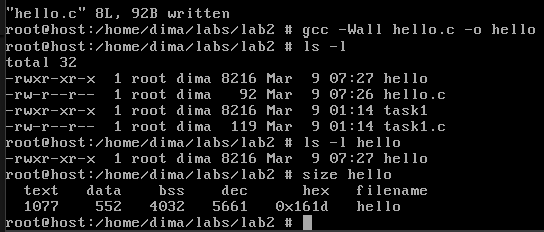

    Рисунок 7 - перекомпіляція

 

Бачимо, що після виконання ls -l збільшився розмір файлу з 8192 до 8216, а після виконання команди size, збільшився тільки сегмент bss з 16 до 4032 байт. Це підтверджує слова в короткій теоретичній довідці про те, що bss - це сегмент неініціалізованих глобальних даних і при додаванні неініціалізованого глобального масиву він, відповідно, збільшився в розмірі. Далі виконаємо пункт 3 (рисунок 8).

    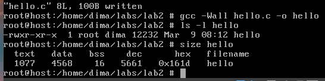

    Рисунок 8 - додавання початкового значення та повторення дій

 

Як і очікували, - масив сегмента BSS перемістився у сегмент даних. Крім цього можна помітити, що значно збільшився розмір файлу після виконання команди ls -l (приблизно як раз на 1000 інтів - на 4000 байтів), тобто це підтверджує слова в теоретичній довідці до цього практичного заняття про те, що на відміну від сегмента даних, BSS не займає реального місця в пам'яті, а знаходиться у віртуальному адресному просторі VAS.

Тепер додамо аналогічний масив в локальну функцію без ініціалізатора та з (рисунок 9, 10).

    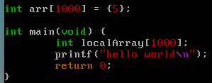

    Рисунок 9 - додавання неініціалазованого масиву в локальну функцію

 

    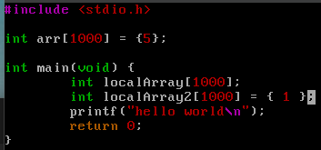

    Рисунок 10 - додавання ініціалазованого масиву в локальну функцію

 

Тепер можемо порівняти результати аналогчних вимірювань (рисунок 11, 12).

    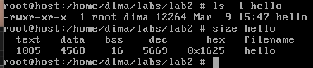

    Рисунок 11 - результат додавання неініціалазованого масиву в локальну функцію

 

    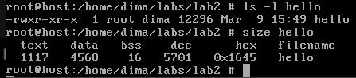

    Рисунок 12 - результат додавання ініціалазованого масиву в локальну функцію

 

Бачимо, що тепер bss та data взагалі не змінюються і масиви (ініціалізовані чи ні) не впливають на ці сегменти. Збільшується трохи розмір текстового сегменту (8-32 байти) і на цю ж величину збільшується загальний розмір виконуваного файлу. Тобто локальні дані розміщуються на стеку і обробляються прямо під час виконання програми, а не під час компіляції та лінкування.

Тепер скомпілюємо останній варіант файлу для налагодження та оптимізації (рисунок 13, 14). На офіційному сайті gcc за посиланням https://gcc.gnu.org/onlinedocs/gcc/Option-Summary.html я знайшов неймовірно велику кількість різних флажків для налагодження та оптимізації. Вирішив зупнитися на перших (для налагодження -g, для оптимізації -O).

    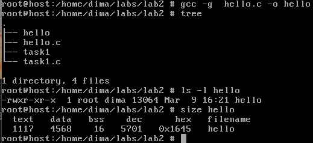

    Рисунок 13 - компіляція та результат з налагодженням

 

    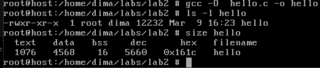

    Рисунок 14 - компіляція та результат з оптимізацією

 

Отже, як бачимо, при налагодженні розмір файлу збільшується, а при оптимізації - зменшується (десь на 60 байтів). Також можна помітити, що при налагодженні, розмір текстового сегменту трохи зменшується.
  

## Завдання 2.3

Знаходимо приблизне розташування вершини стека у системі (рисунок 15).

    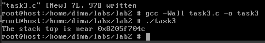

    Рисунок 15 - знаходження приблизного розташування стеку

 

Тепер знайдемо розташування сегментів bss, даних і тексту (рисунок 16, 17).

    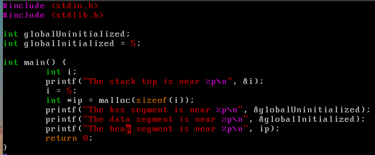

    Рисунок 16 - код для знаходження адрес сегментів

 

    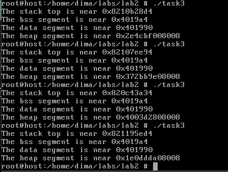

    Рисунок 17 - результат знаходження адрес сегментів

 

Бачимо що bss та сегмент даних знаходяться за постійною адресою, адреса стеку трохи змінюється, але приблизно знаходиться в одному місці, адреса даних на купі завжди змінюється, оскільки це динамічна область пам'яті. Для знаходження адреси текстового сегменту, можна просто вивести адресу будь-якої функції. Або можна скористатися командою objdump -h (рисунок 18).

    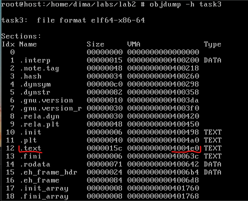

    Рисунок 18 - адреса текстового сегмента

 

Далі збільшимо розмір стека, викликавши функцію й оголосивши кілька великих локальних масивів, і виведемо приблизну адресу стека (рисунок 19).

    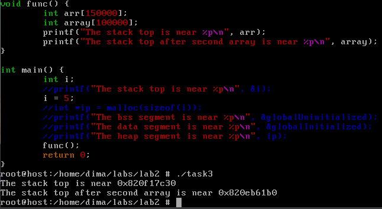

    Рисунок 19 - приблизне розташування стеку після збільшення його розміру

 

Бачимо, що адреси приблизно однакові, як і в попередні рази, - 0х82....
  

## Завдання 2.4

У мене pkg не може знайти gstack, тому за вказівкою, встановив pstack. Оскільки і той і другий пакети в якості аргументу приймають PID процесу, то спочатку подивимось усі процеси, які зараз запущені і їх ID через команду ps (рисунок 20).

    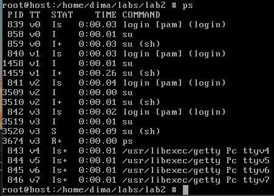

    Рисунок 20 - список процесів

 

Наприклад, візьмемо останній процес у списку з PID 846. Скористаємось pstack (рисунок 21).

    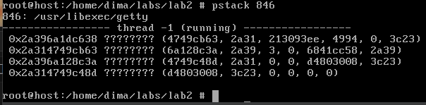

    Рисунок 21 - стек процесу за допомогою pstack

 

> Розбір стека:
> + Зверху вказано що це за процес - /usr/libexec/getty
> + Кожен рядок - це кадр виклику
> + thred -1 (running) - вказує що процес має активний потік, який виконується
> + Зліва є адреси у стеку потоку
> + ?????? - немає доступної інформації про символи
> + З правого боку (...) - аргументи функції

 
Далі переглянемо стек процесу вручну через GDB (рисунок 22).  

    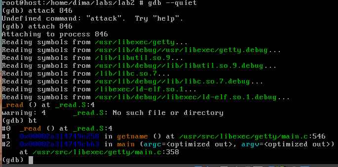

    Рисунок 22 - перегляд стеку через GDB

 

Тут, на відміну від pstack, ми можемо побачити більш структурований стек викликів з іменами функцій, файлами та номерами кадрів.  

## Завдання 2.5

> Відомо, що при виклику процедур і поверненні з них процесор
використовує стек.Чи можна в такій схемі обійтися без лічильника команд
(IP), використовуючи замість нього вершину стека? Обґрунтуйте свою
відповідь та наведіть приклади.

Мені важко уявити процес, у якому при переході за адресою якоїсь функції для виконання її інструкції, її адреса не записувалась би у вершину стека, оскільки після виконання інструкції, процесор має знати куди треба перейти далі і єдиним рішенням для нього - це подивитися вершину стеку, звідки він візьме адресу, через яку зможе повернутися та продовжити виконання процесу. Хіба що на вершині стеку завжди буде адреса, при цьому вона має бути постійною, можливо в такому варіанті це і можливо, але тоді буде максимально неефективно: уявіть собі процес, який може використовувати тільки одну функцію. Або ще, наприклад, уявімо собі, що є механізм, який дозволяє нам дізнатися адреси усіх процедур до виконання програми, наприклад, на етапі компіляції або лінкування, в такому випадку їх можна зберігати у стеку і не використовувати лічильник команд. Взагалі, якщо можна рахувати це як обхід лічильника команд, який вказує на адресу поточної інструкції, який має виконати процесор, то ми вже вивчали один з них - це inline функції. Вони просто на етапі компіляції вставлються в потрібне місце і процесору взагалі нікуди переходити не треба буде.

 

## Завдання 2.6

Варіант 5

> Реалізуйте стекову машину, що використовує сегмент стека для
обчислень.

Наскільки я зрозумів, стекова машина, яка використовує сегмент стека для обчислень, — це машина або система, що виконує обчислення, маніпулюючи даними в основному через стек, замість використання традиційних регістрів або пам'яті для проміжних результатів. Вона зберігає всі операнди й результати операцій у стеку, і операції виконуються шляхом маніпулювання вершинами цього стека.

Реалізуємо таку стекову машину, яка зможе виконувати базові арифметичні операції (наприклад додавання) з цілими числами (рисунок 23, 24, 25).

    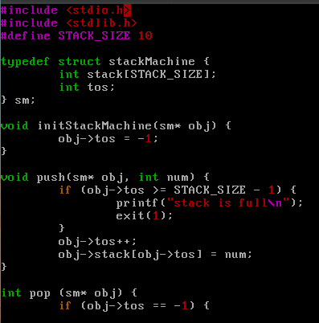

    Рисунок 23 - реалізація стекової машини

 

    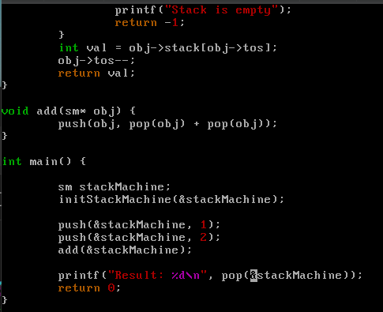

    Рисунок 24 - додаємо в стек 1 та 2, та виконуємо операцію додавання

 

    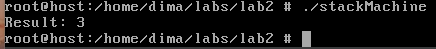

    Рисунок 25 - результат роботи стекової машини

 

