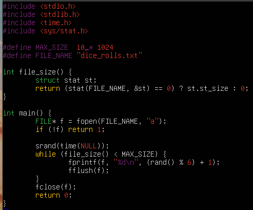
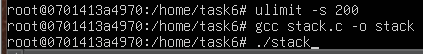

# Лабораторна робота №3

## Завдання 1

Послідовно виконуємо команди для завдання (рисунок 1).

    

    Рисунок 1 - експериментування з лімітом ресурсів відкритих файлів

 

Оскільки завданням передбачено виконувати команди в docker-контейнері, то ми вже маємо root-права.

> **Пояснення**
>
> Спочатку ми передивляємось поточний ліміт (софт ліміт) на кількість відкритих файлів. Потім ми робимо теж саме тільки з префіксами для софт та хард лімітів. І там, і там однакові результати. Потім ми встановлюємо ліміт на 3000 і повторюємо дії. Бачимо що з софт лімітом, змінився ще й хард ліміт. При спробі встановити обмеження на 3001, ми отримуємо помилку. Далі встановлюємо ліміт на 2000, виводмо значення і все нормально. Пробуємо знову встановити 3000 і помилка. **Можемо помітити певну закономірність: контейнер може змінювати ліміт ресурсів відкритих файлів через ulimit тільки вниз і не може підняти вище встановленого значення !.**

 

## Завдання 2

perf (Performance Counters for Linux) — це утиліта для аналізу продуктивності процесора, ядра та користувацьких процесів у Linux. Вона дозволяє збирати дані про CPU, кеш, системні виклики, блокування потоків та багато іншого. Для виконання завдання, напишемо програму (рисунок 2), яка використовує велику кількість обчислень, створюючи навантаження на процесор. Потім виміряємо продуктивність за допомогою perf (рисунок 3).  

    

    Рисунок 2 - цикл для навантаження процесора

 

    

    Рисунок 3 - вивід perf

 

Бачимо, що процес sleep 5 виконувався процесором 5.6 секунд, відбулося лише 8 перемикань контексту, тобто процес не дуже часто витіснявся з ЦП. Процес не мігрував між ядрами ЦП і не мав жодних page fault, тобі він не використовув swap.
  

## Завдання 3

Напишемо програму згідно завдання (рисунок 4, 5).

    

    Рисунок 4 - програма, що імітує кидання кубика

 

    

    Рисунок 5 - результат виконання програми

 

Ми встановили ліміт розміру файлу в 10 * 1024 байтів. Після компіляції бачимо файл, куди записались випадкові числа від 1 до 6. Потім перевіряємо розмір файлу і бачимо 10K, тобто ми коректно обробили ситуацію перевищення ліміту.
  

## Завдання 4

Напишемо програму, що імітує лотерею згідно з вимогами до завдання (рисунок 6), скомпілюємо та запустимо її, щоб впевнитись в коректності роботи програми (рисунок 7).

    

    Рисунок 6 - програмі імітує лотерею

 

    

    Рисунок 7 - результат виконання програми

 

Для обробки ситуації, коли ліміт ресурсу обмеження часу ЦП буде вичерпано, я використав функції signal - для обробки сигналів, та функцію alarm, яка зупинить нормальне виконання програми і викликає функцію, яку ми передаємо в параметри. Для того, щоб продемонструвати роботу цих функцій, допишемо цикл між генераціями чисел (рисунок 8) з подальшою компіляцією та виконанням програми (рисунок 9).

    

    Рисунок 8 - доавання циклу

 

    

    Рисунок 9 - результат додавання циклу

 

Як бачимо, нам вдалося коректно встановити ліміт на час ЦП та обробити випадок, коли ліміт ресурсу вичерпано.

 

## Завдання 5

Реалізуємо програму згідно з вимогами завдання (рисунок 10) та скомпілюємо.

    

    Рисунок 10 - програма для копіювання файлів

 

Протестуємо програму на ліміт розміру файлу. Створимо файл src.txt розміром більше 10 байт та протестуємо програму (рисунок 11).

    

    Рисунок 11 - програма для копіювання файлів

 

Як і очікували, отримали помилку пов'язану з превищенням ліміту розміру файла. Тепер зменшимо обсяг файлу і повторимо дії (рисунок 12).

    

    Рисунок 12 - програма для копіювання файлів

 

Як бачимо, тепер ніяких помилок нема і вміст файлу src.txt успішно записався у файл dest.txt.

 

## Завдання 6

Для початку дізнаємось розмір стеку (рисунок 13).

    

    Рисунок 13 - розмір стеку

 

Тепер напишемо програму з нескінченною рекурсією, оскільки вона активно використовує стек (рисунок 14).

    

    Рисунок 14 - програма з рекурсією

 

Для прискорення виконання програми, зменшимо розмір стеку (рисунок 15) і запустимо програму (16).

    

    Рисунок 15 - зміна розміру стеку

 

    

    Рисунок 16 - результат виконання програми

 

При досягненні ліміту розміра стеку, програма завершується з помилкою.

 

## Завдання 7 (по варіантах)

**У мене п'ятий варіант**.  

Отже встановимо ліміт на використання CPU (рисунок 17).

    

    Рисунок 17 - ліміт по часу на 3 секунди

 

Далі напишемо програму з нескінченним циклом (рисунок 18) та запустимо її (рисунок 19).

    

    Рисунок 18 - нескінченний цикл 

 

    

    Рисунок 19 - результат виконання програми 

 

Після встановленого часу, коли ліміт використання CPU буде досягнутий, програма припиняє свою роботу.

