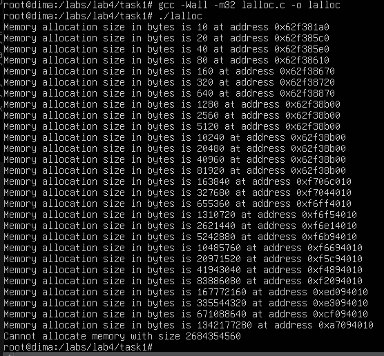

# Лабораторна робота №4

## Завдання 1

На цю ОС я поставив 64 гб (жорсткий диск) та 8 гб (оперативна пам'ять) (рисунок 1).

    

    Рисунок 1 - розмір опертивної пам'яті та жорсткого диску

 

Перевіримо скільки на убунту сервері моя програма зможе виділити пам'яті (рисунок 2, 3, 4).

    

    Рисунок 2 - практичний максимальний розмір виділення пам'яті 

 

    

    Рисунок 3 - компіляція та виконання програми

 

    

    Рисунок 4 - компіляція під х86 та запуск програми

 

> The -m32 option sets int, long, and pointer types to 32 bits, and generates code that runs in 32-bit mode.
https://gcc.gnu.org/onlinedocs/gcc/x86-Options.html

Бачимо, що для х86_64 програмі не вдалося виділити 21.5 ГБ, але вдалося - 10.7 ГБ, для х86: вдалося виділити 1.35 ГБ і не вдалося - 2.7 ГБ.

У відповідь на питання знайшов тільки наступну інформацію: 

> Physical-Address Extensions (PAE). The AMD64 architecture requires physical-address
extensions to be enabled (CR4.PAE=1) before long mode is entered. When PAE is enabled, all paging
data-structures are 64 bits, allowing references into the full 52-bit physical-address space supported by
the architecture. 

Посилання: https://www.amd.com/content/dam/amd/en/documents/processor-tech-docs/programmer-references/24593.pdf

Тобто в даному випадку у нас використовуються 52 біти фізичного адерсного простору, що еквівалентно 4 ПТ. З іншого боку, наприклад, цитата з https://uk.wikibooks.org/wiki/%D0%AF%D0%B4%D1%80%D0%BE_Linux/%D0%9F%D0%B0%D0%BC%27%D1%8F%D1%82%D1%8C

> В x86-64, лише найменші значимі 48 біт адреси віртуальної пам'яті фактично використовуються для перетворення адреси (пошуку по таблиці сторінок). Решта біт від 48 до 63 для будь-якої віртуальної адреси повинні бути копією біта 47, або процесор згенерує виключну ситуацію. Формат адрес що відповідають цьому правилу називають "канонічною формою." Адреси канонічної форми приймають значення від 0 до 00007FFF'FFFFFFFF, і від FFFF8000'00000000 до FFFFFFFF'FFFFFFFF, для загального об'єму в 256 TB доступного для використання віртуального адресного простору. Це приблизно в 64000 разів більше від вірутального адресного простору в 32-бітних машинах. 

Десь може і більше може бути бітів, але все одно немає якоїсь константи і теоретично максимальний обсяг не обов'язково буде 8 або 16 ексабайт або інші значення.

 

## Завдання 2

Давайте перевіримо, що станеться якщо ми передамо malloc від'ємне значення (рисунок 5, 6).

    

    Рисунок 5 - від'ємний параметр для malloc

 

    

    Рисунок 6 - компіляція та запуск програми

 

Отже у вказівник записується NULL, тобто функція не може виділити пам'ять якщо в неї передати від'ємне значення.

Тепер виконаємо другу частину завдання (рисунок 7, 8, 9).

    

    Рисунок 7 - код програми

 

    

    Рисунок 8 - компіляція і запуск під х86_64

 

    

    Рисунок 9 - компіляція і запуск під х86

 

В обох варіантах бачимо переповнення числа в результаті чого воно приймає від'ємне значення і функція повертає NULL.

 

## Завдання 3

Напишемо програму в якій malloc приймає в якості аргемент нуль (рисунок 10, 11).

    

    Рисунок 10 - код програми

 

    

    Рисунок 11 - компіляція і запуск

 

Як бачимо функція успішно спрацювала і виділила пам'ять під... емм... 0 байітв ??. Подивимось що буде якщо запустити через ltrace (рисунок 12).

    

    Рисунок 12 - запуск через ltrace

 

Як бачимо викликаються функції виділення з подальшим звільненням пам'яті і все нормально, програма завершується з exited (status 0).

Знайшов наступну інформацію: 

> In the GNU C Library, a successful malloc (0) returns a non-null pointer to a newly allocated size-zero block; other implementations may return NULL instead. POSIX and the ISO C standard allow both behaviors.
> https://www.gnu.org/software/libc/manual/html_node/Malloc-Examples.html

Тобто існують різні реалізації. В одних повертає NULL, в інших, як в мене, - повертає вказівник на блок з нульовим розміром, який можна потім звільнити і виходить що це не має сенсу, оскільки використати цю пам'ять ніяк не вийде.

 

## Завдання 4

Подивившись на код, я зрозумів, що мені треба дізнатися що буде якщо я викличу free(NULL) (рисунок 13, 14).

    

    Рисунок 13 - free(NULL) код

 

    

    Рисунок 14 - free(NULL) виконання

 

Як бачимо це допустимо і все працює коректно. Далі я задумався над наступним: якщо malloc(n) завжди повертає NULL то пробелм не буде, якщо у блоці "використання" ми попередьно перевіримо чи не нульовий у нас вказівник, ну бо бог його знає що в цьому блоці може бути, наприклад ділення на вказівник, відповідно ділення на нуль, АЛЕ якщо malloc(n) поверне адресу, потім звільняється пам'ять і що буде знаходитись в ptr ? адреса чи NULL ? Цього я не пам'ятаю тому перевірю (рисунок 15, 16).

    

    Рисунок 15 - що знаходиться в ptr після free()

 

    

    Рисунок 16 - результат виконання

 

Ага ! Тут можемо вже і підказку від компілятора побачити. Ось і проблема. Після free у ptr не записується NULL, а залишається адреса. Сама по собі адреса - це шістнадцяткове число і, відповідно, якщо у циклі у нас умова завжди повертає true, то if в циклі вже не спрацює, оскільки в умові число приводяться до типу bool, а усі числа, окрім нуля, приводяться до true. Далі ми ніяк не перевіримо цей вказівник, а будь-яке використання вказівника призведе не неочікуваної, невизначеної поведінки програми, оскільки ми звертаємось до блоку пам'яті, який до цього звільнили через free(), хоча помилок не має бути якщо ми просто виводимо адресу на екран, але це може вводити в оману: ми можемо думати що якщо є адреса, то все нормально і ми можемо використовувати цей вказівник. При використанні може статися будь-що: ми зможемо звернутися до цього блоку пам'яті і навіть записати туди щось без ніякої помилки, хоча в цей же момент могли тільки що пошкодити інші дані, які використовує програма, або екстренне завершення програми з вказівкою що ми звертаємось до області пам'яті, яка нам не належить, або помилок нема при використанні цього блоку пам'яті, але далі програма починає видавати неочікуванні результати, і саме найгірше у можливих варіантах - це коли компілятор не видає помилки, оскільки їх потім у коді дуже важко відслідкувати.

Для виправлення, найлегшим варіантом який я бачу - це занулення після звільнення. Тобто дописати після 
> free(ptr); 

рядок 

> ptr = NULL;

і тоді помилок бути не має.

 

## Завдання 5

Сама по собі функція realloc() намагається змінити розмір блоку пам'яті, який ми передаємо як параметр разом з бажаним розміром.

Напишемо програму згідно вимогам, просто передавши за бажаний розмір якесь велике значення (рисунок 17), скомпілюємо та запустимо програму (рисунок 18).

    

    Рисунок 17 - код програми з використанням realloc()

 

    

    Рисунок 18 - результат

 

Як бачимо, якщо realloc(3) не зможе виділити пам'ять, то він просто поверне NULL.

 

## Завдання 6

Оскільки NULL - це просто макрос, замість якої препроцесор всюди підставляє нуль, то для виконання я використаю той же файл, що і в попередньому завданні, просто замість аргументу realloc() 10000000.... я напишу 0 (рисунок 19, 20).

    

    Рисунок 19 - realloc() з розміром 0

 

    

    Рисунок 20 - результат

 

Можемо бачити, що у нас помилка, оскільки два раза викликається free() на одну і туж саму область пам'яті. Швидко дізнавшись, що realloc() з розміром 0 викликає free() та повертає NULL, мені захотілось перевірити чи дійсно це так (рисунок 21, 22)

    

    Рисунок 21 - коментування free()

 

    

    Рисунок 22 - результат

 

Як бачимо, піся коментування free(ptr); дійсно все працює нормалльно і помилок нема, отже, по-перше, realloc() з розміром 0 дійсно викликає free() для вказаної області пам'яті, та, по-друге, повертає NULL (це легко помітити, оскільки вивід 'Cannot reallocate memory' можливий тільки якщо умова new_ptr == NULL повертає true).

 

## Завдання 7

Для початку я скористаюсь командою ***man*** для того, щоб дізнатись, що робить функція reallocarray(3) (рисунок 23).

    

    Рисунок 23 - результат 'man reallocarray'

 

Тобто ця функція приймає вказівник на область пам'яті і ще два аргументи типу size_t: кількість елементів nmemb та розмір кожного елемента size. Вона аналогічна функції realloc(prt, nmemb * size), але не відміну від realloc, безпечно завершується у випадку переповнення при множенні nmemb * size. Тепер ми можемо переписати програму, для цього я закоментую realloc та наступним рядком використаю reallocarray (рисунок 24).

    

    Рисунок 24 - переписаний код з використанням reallocarray(3)

 

Тепер давайте порівняємо обидва варіанти з використанням ltrace (рисунок 25, 26).

    

    Рисунок 25 - ltrace до переписання програми

 

    

    Рисунок 26 - ltrace після переписання програми

 

Тобто різниці немає, в обох випадках ми отримуємо адресу перевиділеної пам'яті (видно що це одна й та сама область, що була виділена за допомогою calloc). Основна перевага reallocarray тут - це, як вже було сказано, безпечна обробка переповнення.

 

## Завдання 8 (по варіантах)

**У мене п'ятий варіант**.

> Використайте mprotect для створення області пам’яті, що неможливо змінювати.

В лекції є наступна інформація про цю функцію (рисунок 27).

    

    Рисунок 27 - mprotect в лекції

 

Можемо більш детально дізнатися про цю функцію через команду man (рисунок 28).

    

    Рисунок 28 - mprotect через man

 

Тобто mrotect приймає вказівник на початок області пам'яті, для якої ми хочемо змінити захист, довжину області пам'яті сторінки та право доступу що являє собою бітову маску (можемо пабачити на рисунках прапорці PROT_NONE, PROT_READ і т.д.). Також важливо, щоб адреса була вирівняна за границею сторінки, а отже простого використання malloc нам вже не достатньо. Значення розміру сторінки з візьму з лекції за допомогою sysconf(_SC_PAGESIZE). В лекції для вирівнювання використовується posix_memalign. Я теж скористаюсь цією функцією для виконання завдання (рисунок 29, 30).

    

    Рисунок 29 - коод програми з використанням mprotect

 

    

    Рисунок 30 - результат програми

 

Бачимо Segmentation fault (core dumped) - це підтверджує, що mprotect() працює і не дозволяє запис у захищену область пам'яті. 

