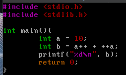
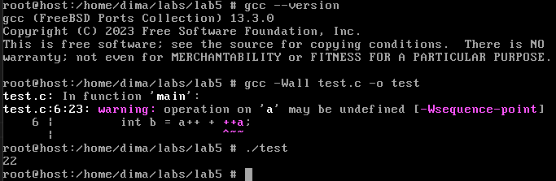
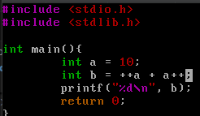
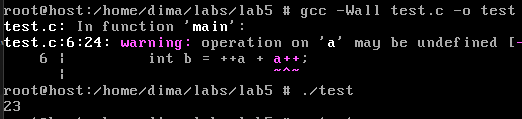
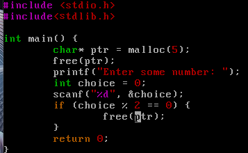
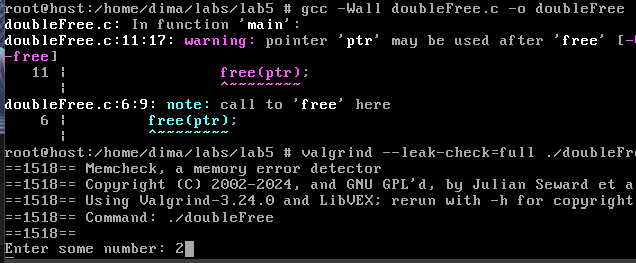
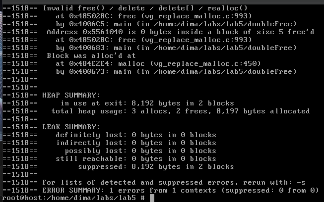

# 
Лабораторна робота №5

В теоретичній частині до valgrind-практики мене зацікавив один приклад (рисунок 1).

    

    Рисунок 1 - код до прикладу невизначеної поведінки

 

    Зацікавив просто бо не пригадую, щоб виконував подібні операції. В теорії сказано, що поведінка невизначена і такий вираз може дати різний результат на різних компіляторах. Мені захотілось подивитись результат мого компілятора. Як бачимо у мене gcc 13.3.0 (рисунок 2).

    

    Рисунок 2 - результат виконання коду

 

    В результаті (рисунок 2) бачимо результат 22. Тобто спочатку виконались операції з пост- та пре- інкрементами, а потім вже сама операція додавання. Сам компілятор теж пише про те, що операція саме з префіксним інкрементом може бути невизначена. Мені це здалось дивним, тому я поміняв місцями операнди (рисунок 3, 4).

    

    Рисунок 3 - код зі зміною місцями операндів

 

    

    Рисунок 4 - результат коду після зміни місцями операндів

 

    Неочікуваний результат (принаймні для мене). Тобто виходить, що спочатку виконалась операція з пре-інкрементом, після чого а = 11, а потім  пост-інкремент, після якого а = 12 (що дивно, оскільки судячи з першого прикладу, операція з пост-інкрементом повинна була виконатись після операції додавання), і потім операція додавання. А в минулому прикладі виходить, що після постфіксного інкремента на місце операнда стало 11, але при ++а замість 'a' підставилось все одно 10, можливо через те що при першій операції з постфіксним інкрементом спочатку повертається значення змінної, а потім вже збільшується на одиничку (після операції додавання). 

 

## 
Варіант 5

 

> 5. Реалізуйте фрагмент програми з подвійним звільненням пам’яті, який не завжди викликає помилку при виконанні.

 

    Наприклад, спочатку виділяємо пам'ять, одразу звільняємо її, потім надаємо користувачу можливість ввести якесь число, якщо число непарне, то нічого не відбувається, а якщо парне, - то повторно звільняємо пам'ять (рисунок 5).

    

    Рисунок 5 - фрагмент коду згідно з завданням

 

    Скористаємось таким інструментом як valgrind для налагодження та знаходження помилок при роботі з пам'яттю (рисунок 6, 7).

    

    Рисунок 6 - компіляція та запуск через valgrind

 

    

    Рисунок 7 - результат виконання

 

    Бачиом, що спочатку компілятор попереджає нас, що вказівник ptr може бути використаним після звільнення. Потім, при запуску та введенням парного значення, valgrind видає нам помилку: Invalid free()... (хоча при запуску програми без valgrind ніякої помилки нема).

