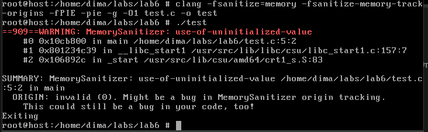

# 
Лабораторна робота №6

## 
Варіант 5

 

> 5. Test Case #1: реалізуйте і відловіть доступ до неініціалізованої
змінної (наприклад, локальної int).

 

     Для початку реалізуємо код з доступом до неініціалізованої змінної, для цього скористаємось кодом Test Case #1 з лекції (рисунок 1).

    

    Рисунок 1 - код з використанням неініціалізованої змінної

 

    Для відловлення скористаємось тими інструментами, з якими нас ознайомили в лекції, а саме: Valgrind - інструмент для динамічного аналізу пам’яті та AddressSanitizer (ASan) - швидкий інструмент від Google для виявлення
    помилок пам’яті. Valgrind в мене встановлений з минулої лабораторної, з нього і почну (рисунок 2)

    

    Рисунок 2 - відловлення з Valgrind

 

    Як бачимо, маємо таку ж саму помилку, як і в лекції:

> ***Conditional jump or move depends on uninitialised value(s).***

    Крім того, сам компілятор при компіляції попереджає нас про використання неініціалізованої змінної:

> ***warning: 'x' is used uninitialized...***

    Тепер відловимо з використанням ASan. Для цього скомпілюємо наш файл згідно з вказівками в лекції (рисунок 3).

    

    Рисунок 3 - компіляція з ASan

 

    Помилка означає, що санітайзер не працює з виконуваними файлами, скомпільованими з включеним PIE (Position Independent Executable), а також при включеному ASLR (Address Space Layout Randomization).
    Для вирішення відключимо ASLR та компілюємо з прапорцем -no-pie (рисунок 4).

    

    Рисунок 4 - виправлення помилки

 

    Тепер помилки немає і програма виконується, але ASan не зміг виявити ніяких помилок. Спочатку переконаємось, що ASan взагалі працює на прикладі з очевидною помилкою  (рисунок 5, 6).

    

    Рисунок 5 - код для тестування ASan

 

    

    Рисунок 6 - тестування ASan

 

    Як бачиом, санітайзер дійсно працює та виявляє помилку з  подвійним звільненням пам'яті. Отже він не призначений для виявлення неініціалізованих змінних. Для цього можна використати MSan (Memory Sanitizer).

> https://github.com/google/sanitizers/wiki/MemorySanitizer

    

    Рисунок 7 - компіляція з MSan та запуск

 

    Цей інструмент чітко відловлює такі моменти і видає нам попередження про використання неініціалізованого значення.

