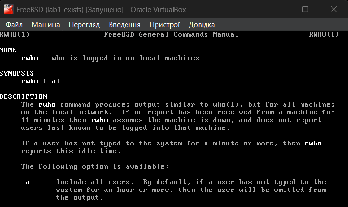

# 
Лабораторна робота №7

 

    Задача 1 
    Використайте popen(), щоб передати вивід команди rwho (команда UNIX) до more (команда UNIX) у програмі на C.

    Для початку дізнаємось інформацію про команду popen() за допомогою man у FreeBSD (рисунок 1).

    

    Рисунок 1 - результат команди man popen

 

Тобто popen() відкриває процес для читання або запису, подібно до fopen, але замість файлу — це інший процес. Тепер дізнаємось про rwho та more (рисунок 2, 3).

    

    Рисунок 2 - результат команди man rwho

 

За описом, ця команда виводить список користувачів з усіх машин, які зараз працюють в локальній мережі.
У терміналі після введення команди man more мені показувалася інформація про less, тому знайшов наступну інформацію (рисунок 3).
    
> https://man7.org/linux/man-pages/man1/more.1.html

    

    Рисунок 3 - інформація про more

 

Судячи з останнього речення, тепер зрозуміло, чому після введення команди man more, мені видалась інформація про less - ця команда є обгорткою для more і є потужнішою, оскільки має додаткові можливості. Сама же команда просто показує текст посторінково. Тобто задача полягає в тому, щоб зчитати поток процесу rwho (і для зчитування і для запису, наскільки я зрозумів, можна використовувати FILE*, оскільки саме цей тип даних повертає popen), що містить список користувачів і передати його до команди more (рисунок 4).

    

    Рисунок 4 - код процесу 

 

Після кожного зчитування іде перевірка на NULL, тобто якщо чомусь зчитування буде неуспішним, то виводиться повідомлення про це і програма завершується. Є буфер для зчитування, в який ми циклом через fgets зчитуємо дані і одразу їх записуємо (якщо fgets не поверне NULL). Компілюємо та запускаємо програму (рисунок 5).

    

    Рисунок 5 - результат коду

 

Як бачимо, вивівся список користувачів, які знаходяться в локальній мережі і виконується команда more яка очікує натискання клавіш для посторінкового перегляду тексту.

 

 

    Задача 2
    Напишіть програму мовою C, яка імітує команду ls -l в UNIX — виводить список усіх файлів у поточному каталозі
    та перелічує права доступу тощо. (Варіант вирішення, що просто виконує ls -l із вашої програми, — не підходить.)

По факту треба просто реалізувати ls -l вручну (оскільки, за завданням, варіант з popen напряму не підходить). Для цього будемо використовувати інші функції для роботи з каталогами та файлами. Для початку знайду інформацію про такі функції.

> https://www.youtube.com/watch?v=0pjtn6HGPVI

Тут використовується POSIX-бібліотека dirent.h, саме її і використаємо. В ній є структура dirent, яка містить поля з інформацією про каталоги (рисунок 6).

    

    Рисунок 6 - структура dirent через команду man dirent

 

    На основі цього можна написати код для виконання завдання (рисунок 7, 8).

    

    Рисунок 7 - код процесу 

 

    

    Рисунок 8 - результат виконання процесу 

 

 

    Задача 3
    Напишіть програму, яка друкує рядки з файлу, що містять слово, передане як аргумент програми (проста версія утиліти grep в UNIX).

Напишемо програму, яка при запуску приймає в якості аргументу якесь слово, будемо зчитувати построково файл, і якщо в якомусь рядку буде ідентичне слово, то рядок виводиться на екран, зчитування іде до кінця файлу, а для знаходження слів будемо використовувати функцію strstr з бібліотеки string.h, яка шукає підрядок в рядку. Довжина рядка нехай буде 50 символів (рисунок 9).

    

    Рисунок 9 - код процесу

 

    

    Рисунок 10 - вміст файлу data.txt

 

    

    Рисунок 11 - результат виконання коду 

 

 

    Задача 4
    Напишіть програму, яка виводить список файлів, заданих у вигляді аргументів, 
    з зупинкою кожні 20 рядків, доки не буде натиснута клавіша (спрощена версія утиліти more в UNIX).

Умову важко зрозуміти (передавати список файлів в якості аргументів і потім цей же список вивести ??... через кожні 20 рядків, виходить в якості аргументу має іти принаймні 20 різних файлів щоб був хоча б якийсь ефект як при використанні утиліти more ???). Трохи зміню формулювання завдання і тоді бачу це наступним чином: на вхід програма буде приймати імена файлів, сам же процес буде проходитись по усім файлам і виводити 20 рядків їхнього вмісту, потім процес чекає на натискання клавіші, наприклад, '\n' - enter, і так по колу доки не будуть зчитані усі файли, довжина рядка нехай буде 50 символів (рисунок 12, 13).

    

    Рисунок 12 - основний код процесу (повний код - див. /code/task4.c)

 

Також мені захотілось реалізувати невелику деталь, а саме коли ми натискаємо enter, то попереднє повідомлення по типу "введіть ентер для продовження" залишається зверху і щоб уникнути цього, мені довелось пригадати escape-послідовності, з якими останній раз працював в курсовій з минулого року. І знайшов наступне: \033[1A - послідовність, яка піднімає курсор на рядок вище, \033[K - стирає рядок, \r - ставить курсор на початок рядка, саме ці послідовності знадобилися для приємного перегляду вмісту файлів.
В якості аргументів, наприклад, візьмемо попередні .c файли (рисунок 10).

    

    Рисунок 13 - результат виконання 

 

 

    Задача 5
    Напишіть програму, яка перелічує всі файли в поточному каталозі та всі файли в підкаталогах.

Очевидно, що завдання вимагає рекурсію, оскільки нам в каталогах треба шукати усе: і файли і каталоги, а в тих каталогах що знайдуться теж треба шукати і файли і каталоги і т.д. Для роботи з файлами і каталогами, як і в другому завданні, буду використовувати бібліотеку dirent.h (рисунок 14) Це буде щось по типу команди tree, принаймні дизайн планую зробити таким же. 

    

Рисунок 14 - основний код процесу (повний код - див. /code/task5.c)

 

    

    Рисунок 15 - результат виконання процесу

 

Для порівняння ось результат виконання справжньої команди tree

    

    Рисунок 16 - результат виконання tree

 

handle_opendir, handle_closedir - функції, які обробляють відкриття і закриття потоків директорій, наскільки я зрозумів, тут аналогічно до файлового потоку. Також є макроси з юнікодом символів, такими же як і в утиліті tree. У самій рекурсії використовується статична змінна яка є глубиною рекурсії, хоча можна було б і зробити цю змінну глобальною. 
Також варто зазначити, що спочатку у функції не було інших функцій, тобто це був один великий шмат коду, і не зручно у редакторі верх-вниз гортати(неважливо чи то nano чи vim, яким особисто користуюсь зараз, чи то інші якісь текстові редактори у FreeBSD), тепер ще раз впевнився що функції не мають бути великими (до 20-30 рядків) і, по можливості, розбивати функцію на більш маленькі функції. 
Для такого випадку у нас все добре, але
є деякі нюанси, на вирпавлення яких в мене вже нема ідей і не вистачає часу, ось, наприклад, перевірка вмісту для першої лабораторної (рисунок 17, 18).

    

    Рисунок 17 - результат виконання tree для lab1

 

    

    Рисунок 18 - результат виконання ./task5 для lab1

 

    Для аналізу також вивожу глубину рекурсії, і для деяких файлів вонна повинна була бути 0 - тобто це рівень початкової директорії, це описується в циклі в якому виконується функція quit_dir, бо саме вона понижує глубину у випадку, якщо більше неможливо відкрити жодний файл або папку в поточному каталогу, і тоді ми якби виходимо з каталогу на рівень вище (глубина рекурсії зменшується) щоб іти далі, але тут чомусь цього не відбувається, тобто функція працює і директорії відкриваються, але глубина не змінюється, а вона є однією з основних компонентів для візуалізації дерева директорій.

 

 

    Задача 6
    Напишіть програму, яка перелічує лише підкаталоги у алфавітному порядку.

За основу візьму код з попередьного завдання. Тут буде легше, оскільки один з перших пунктів виконання попереднього завдання у мене був перелічити усі каталоги, а вже потім регулярні файли, думаю можна зробити глобальний масив і додавати туди імена каталогів, потім просто відсортувати їх за алфавітним порядком і вивести на екран. Сортувати будемо методом бульбашки (рисунок 19, 20).

    

    Рисунок 19 - основний код процесу (повний код - див. /code/task6.c)

 

    

    Рисунок 20 - результат виконання

 

 
У коді я прибрав, у порівнянні з попереднім завданням, функції для виводу регулярних файлів і додав глобальний масив з рядків, які будуть списком каталогів; сортуємо його бульбашкою. Усю структуру каталогів, файлів і коду можна подивитися у папці /code та перевірити результат.

 

 

    Задача 7
    Напишіть програму, яка показує користувачу всі його/її вихідні програми на C, а потім в
    інтерактивному режимі запитує, чи потрібно надати іншим дозвіл на читання (read
    permission); у разі ствердної відповіді — такий дозвіл повинен бути наданий.

Напишемо код згідно з завданням (рисунок 21).
Використаємо popen з командою "find . - type f -name "*.c" -user $(whoami)".   Тут find - це утиліта для пошуку файлів у дереві каталогів, '.' - шукаємо у поточній директорії, type -f - шукаємо тільки файли, -name "*.c" - тільки .с файли, -user $(whoami) - вказуємо що це мають бути файли, які належать поточному користувачу (в моєму випадку - це root).

> https://man7.org/linux/man-pages/man1/find.1.html

Для надання прав читання іншим користувачам, використаємо функцію з stdlib.h system(), яка дозволяє виконати команду терміналу прямо з програми, а сама команда - chmod o+r path - надає доступ іншим користувачам на читання файлу з шляхом path.

> https://www.linuxcommand.org/lc3_man_pages/chmod1.html

    

    Рисунок 21 - код процесу

 

 
Тепер скомпілюємо та запустимо програму (рисунок 22). Для деяких файлів надамо дозвіл на читання, для деяких - ні.

    

    Рисунок 22 - виконання процесу 

 

 
Для перевірки скористаємось командою ls -l *.с.

> https://askubuntu.com/questions/528411/how-do-you-view-file-permissions

rwx - це дозвіл на читання, написання і виконання, і є декілька груп, перша - це власник, друга - це група і третя - інші користувачі, тобто дивимочь на третю групу (рисунок 23).

    

    Рисунок 23 - перевірка виконання

 

 
Як бачимо, все працює, для task6.c і task7.c ми заборонили читання, а для іншиї файлів - дозволили. Тим файлам, яким ми дозволили читання - у кінці стоїть r--, тим кому заборонили буде пропуск ---.

 

 

    Задача 8
    Напишіть програму, яка надає користувачу можливість видалити будь-який або всі
    файли у поточному робочому каталозі. Має з’являтися ім’я файлу з запитом, чи слід його
    видалити.

 
Скористаємось, вже знайомою бібліотекою, dirent.h. У циклі проходимось по усім директоріям в поточному каталозі і надаємо користувачу можливість видалити файли. Видаляються вони через бібліотечну функцію remove() з stdio.h.

> https://man7.org/linux/man-pages/man3/remove.3.html

 

    

    Рисунок 24 - осноний код процесу

 

 
Додамо, наприклад файл www.txt, який потім видалимо (рисунок 25).
Скомпілюємо та протестуємо програму (рисунок 26, 27).

 

    

    Рисунок 25 - додавання www.txt (перегляд через tree)

 

    

    Рисунок 26 - видаляємо створений файл

 

    

    Рисунок 27 - результат виконання програми

 

 
Як бачимо, видалився саме той файл, які ми вибрали під час виконання програми, решта залишилися недоторканими.

 

 

    Задача 9
    Напишіть програму на C, яка вимірює час виконання фрагмента коду в мілісекундах.

 
Використаємо для виконання завдання бібліоетку time.h. 
Для імітації виконання програми буде цикл, який хоч трохи нагрузить процес по часу (рисунок 28), можна використати і sleep(), але тут захотів саме так. Також залишу посилання на відео, звідки згадував інформацію (тут про c++ ctime, але ctime в основі використовує time.h).

> https://www.youtube.com/watch?v=dC_RI3z7F_E&list=PLiPRE8VmJzOpn6PzYf0higmCEyGzo2A5g&index=86

    

    Рисунок 28 - код процесу

 

 
Компілюємо та запускаємо програму (рисунок 29).

 

    

    Рисунок 29 - результат виконання

 

 

    Задача 10
    Напишіть програму мовою C для створення послідовності випадкових чисел з
    плаваючою комою у діапазонах:
    (a) від 0.0 до 1.0
    (b) від 0.0 до n, де n — будь-яке дійсне число з плаваючою точкою.
    Початкове значення генератора випадкових чисел має бути встановлене так, щоб
    гарантувати унікальну послідовність.
    Примітка: використання прапорця -Wall під час компіляції є обов’язковим.

 
Для унікальності випадкових значень будемо використовувати srand((unsigned int)time(NULL)), яке просто в якості зерна встановить час в секундах, пройдений з 1 січня 1970 року до моменту виконання цієї функції. 

 

    

    Рисунок 30 - код програми

 

    

    Рисунок 31 - результат виконання

 

Знову ж таки, це тільки псевдогенератор, бо він використовує зерно, а це вже означає, що значення не буде повністю випадковим, бо якщо задати одне й те саме зерно, то послідовність "випадкових" чисел буде однаковою. Для справжніх випадкових чисел треба використовувати функції, які можуть отримувати апаратні дані на основі фізичних явищ.

 

## 
Варіант 5

 

    5. Створіть команду, яка виводить дерева викликів системних викликів
    (syscalls) під час виконання довільної програми без використання strace.

 

Для того, щоб створити власну команду, спочатку треба написати скрипт (рисунок 32).

> https://askubuntu.com/questions/789476/how-to-create-my-own-terminal-commands

    

    Рисунок 32 - скрипт для виведення дерева системних викликів довільної програми

 

Тут, згідно з умовами завдання, замість strace використовується dtrace.

> https://wiki.freebsd.org/DTrace

Далі треба перенести скрипт у /usr/local/bin/mtrace (рисунок 33).

    

    Рисунок 33 - перенесення скрипта

 

Тепер можемо викликати команди з довільною програмою і продивитися дерево системних викликів (рисунок 34).

    
    

    Рисунок 34 - результат виконання команди

 

