

# 
Лабораторна робота №8

## 
Системні виклики в UNIX/POSIX (файлові операції, fork(), qsort(), write(), read(), lseek() тощо) 

 

    Завдання 8.1
    Чи може виклик count = write(fd, buffer, nbytes); повернути в змінній count
    значення, відмінне від nbytes? Якщо так, то чому? Наведіть робочий
    приклад програми, яка демонструє вашу відповідь.

Перше що захотілось - це написати man write в терміналі FreeBSD, і дізнався, що цифри в дужках не просто так стоять, бо спочатку мені видало ось це (рисунок 1).

    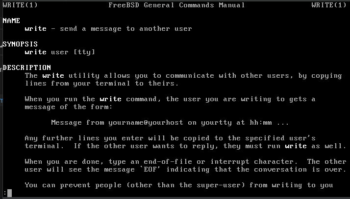

    Рисунок 1 - результат команди man write

 

Щось не так. І на це знайшов наступне (рисунок 2): 

> https://man7.org/linux/man-pages/man7/man-pages.7.html

    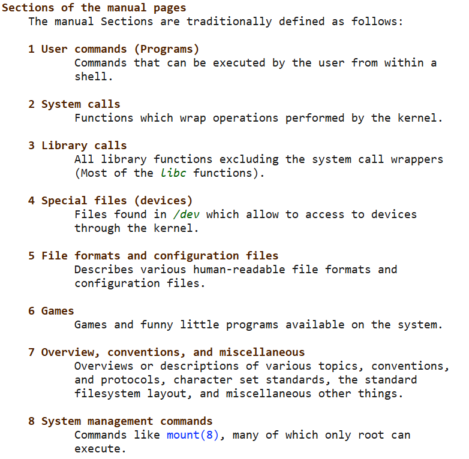

    Рисунок 2 - секції manual pages

 

Тут навіть є секція для ігор, цікаво... Оскільки тема лабораторної "системні виклики..." то, швидше за все, потрібна функція write знаходиться у другій секції (рисунок 3, 4).

    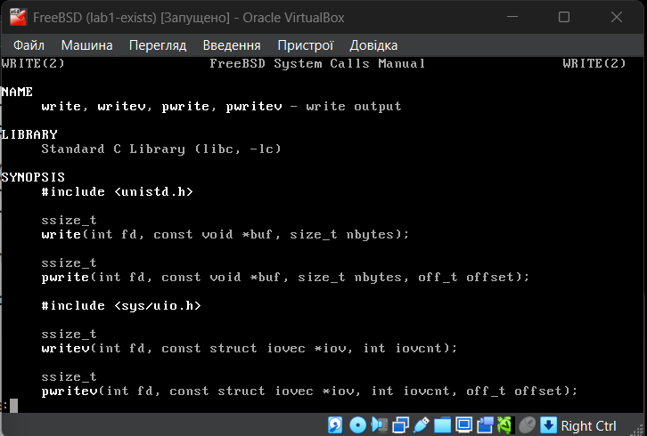

    Рисунок 3 - результат команди man 2 write

 

    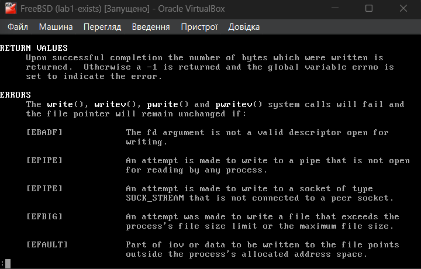

    Рисунок 4 - значення, які повертає функція

 

Тут fd — файловий дескриптор, куди буде виконано запис (в Unix та Unix-подібних операційних системах файловий дескриптор — це невід’ємне ціле число (ідентифікатор), закріплене за певним потоком вводу-виводу <a href="https://uk.wikipedia.org/wiki/%D0%A4%D0%B0%D0%B9%D0%BB%D0%BE%D0%B2%D0%B8%D0%B9_%D0%B4%D0%B5%D1%81%D0%BA%D1%80%D0%B8%D0%BF%D1%82%D0%BE%D1%80"> https://uk.wikipedia.org/wiki/Файловий_дескриптор</a>), buf — вказівник на буфер з даними, які треба записати, nbytes — кількість байтів для запису. Повертає кількість байтів, які було успішно записано, -1 — у разі помилки. Тобто відповідь на питання: "Чи може виклик count = write(fd, buffer, nbytes); повернути в змінній count
значення, відмінне від nbytes?" - так може і для цього треба якесь неуспішне завершення запису байтів, наприклад EBADF (рисунок 4) - the fd argument is not a valid descriptor open for writing (рисунок 5, 6).

    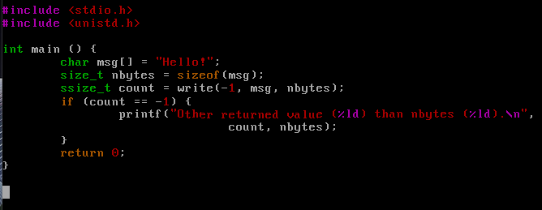

    Рисунок 5 - код програми

 

    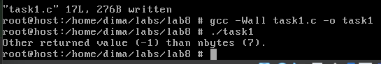

    Рисунок 6 - результат виконання

 

 

    Завдання 8.2
    Є файл, дескриптор якого — fd. Файл містить таку послідовність байтів:
    4, 5, 2, 2, 3, 3, 7, 9, 1, 5. У програмі виконується наступна послідовність
    системних викликів:
    lseek(fd, 3, SEEK_SET);
    read(fd, &buffer, 4);
    де виклик lseek переміщує покажчик на третій байт файлу. Що буде
    містити буфер після завершення виклику read? Наведіть робочий приклад
    програми, яка демонструє вашу відповідь.

Саме функція open() з бібліотеки &lt;fcntl.h&gt; (<a href="https://man7.org/linux/man-pages/man2/open.2.html">https://man7.org/linux/man-pages/man2/open.2.html</a>) повертає файловий дескриптор, а в якості параметра має бути шлях до файлу і режим відкриття (The argument flags must include one of the following access modes:
        O_RDONLY, O_WRONLY, or O_RDWR.  These request opening the file
       read-only, write-only, or read/write, respectively). lseek() з бібліотеки &lt;unistd.h&gt;(<a href="https://man7.org/linux/man-pages/man2/lseek.2.html">https://man7.org/linux/man-pages/man2/lseek.2.html</a>) - переміщує поточний показчик файлу, read() з бібліотеки &lt;unistd.h&gt; (<a href="https://man7.org/linux/man-pages/man2/read.2.html">https://man7.org/linux/man-pages/man2/read.2.html</a>) - читає байти з поточної позиції покажчика у буфер. 
        Тобто що у нас відбувається: спочатку ставиться показжик на три, тобто на четвертий байт у послідовності, оскільки нумерація починається з нуля, потім іде зчитування у буфер чотирьох байтів, а саме: 2 3 3 7.
        Відповідно до отриманої інформації можемо написати код і перевірити (рисунок 7, 8, 9).

    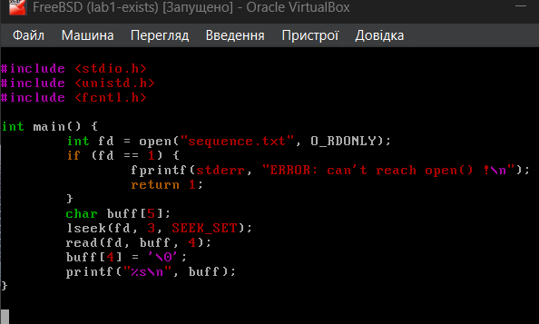

    Рисунок 7 - код програми

 

    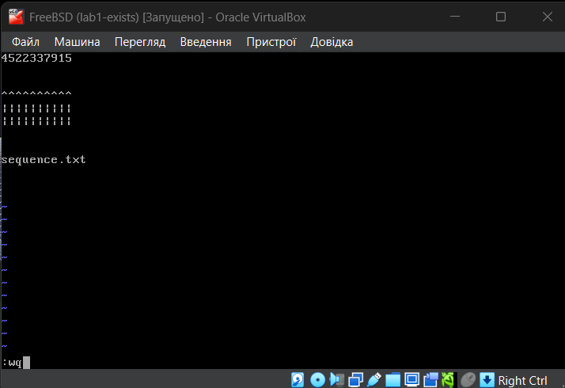

    Рисунок 8 - текстовий файл з послідовністю цифр

 

    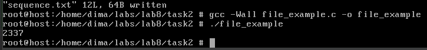

    Рисунок 9 - результат виконання

 

 

    Завдання 8.3
    Бібліотечна функція qsort призначена для сортування даних будь-якого
    типу. Для її роботи необхідно підготувати функцію порівняння, яка
    викликається з qsort кожного разу, коли потрібно порівняти два значення.
    Оскільки значення можуть мати будь-який тип, у функцію порівняння
    передаються два вказівники типу void* на елементи, що порівнюються.
    ● Напишіть програму, яка досліджує, які вхідні дані є найгіршими для
    алгоритму швидкого сортування. Спробуйте знайти кілька масивів
    даних, які змушують qsort працювати якнайповільніше.
    Автоматизуйте процес експериментування так, щоб підбір і аналіз
    вхідних даних виконувалися самостійно.
    ● Придумайте і реалізуйте набір тестів для перевірки правильності
    функції qsort.

Для виконання цього завдання спочатку детальніше дізнаємось про функцію qsort() (<a href="https://man7.org/linux/man-pages/man3/qsort.3.html">https://man7.org/linux/man-pages/man3/qsort.3.html</a>). Тобто функція має наступний прототип (це саме прототип з manual page у FreeBSD): 

`void qsort(void* base, size_t nmemb, size_t size, int (*compar)(const void*, const void*));`

де  
*base* - вказівник на початок масиву, 
*nmemb* - кількість елементів у масиві, 
*size* - розмір одного елемента у байтах, 
*compar* - вказівник на функцію порівняння, яка визначає порядок сортування. 

Конкретно цю функцію ми не розбирали в минулому році, наскільи пам'ятаю, але ми розбирали різні алгоритми сортування, включно з алгоритмом швидкого сортування, там ми брали якийсь опорний елемент (найчастіше середній), потім розбивали на менші масиви, які відносно опорного елемента ми ставили або правіше, або лівіше в залежності від того, більше чи менше має значення якийсь елемент відносно опорного і рекурсивно проходились по усім меншим масивам, поки не буде одного елемента в меншому масиві, або поки він взагалі не буде порожнім. І швидкість такого сортування в середньому це O(n log(n)) - вона ж і найкраща, але найгіршою може бути O(n2). Відповідно нам треба знайти дані, які дадуть нам найгірший час. Цей час зумовлюється частотою викликів функцій порівняння, а оскільки алгоритм швидкого сортування "не бачить" тип даних, а працює саме з функцією порівняння, то тип даних не має великого значення для того, щоб зрозуміти, які дані є "поганими" для алгоритму - важливим є саме порядок початкових даних: відсортований, випадковий, зворотний порядок, або якщо є тільки однакові значення у масиві і т.д. Для дослідження напишемо додатково функцію, яка просто буде вимірювати час усього сортування масиву через clock() - це знадобиться для порівняння. На рахунок перевірки і тестів, можна написати функцію, яка просто буде перевіряти в кінці, чи відсортовано масив і якщо у послідовності знайдеться якийсь елемент, який буде більшим за наступний, то алгоритм швикдого сортування несправний, що малоймовірно. Для простоти, будемо працювати з цілочисленним типом даних (рисунок 10, 11, 12).

    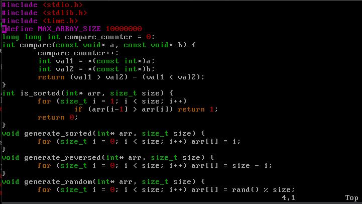

    Рисунок 10 - код функцій пепревірки сортування, генерацій та порівняння

 

    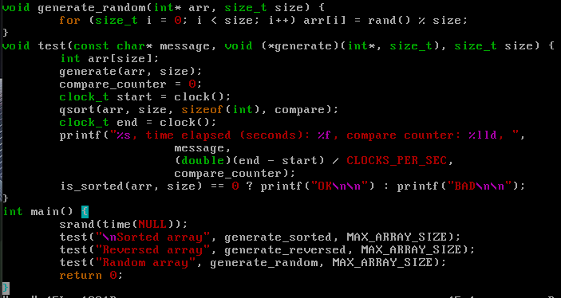

    Рисунок 11 - код тестової та основної функції

 

    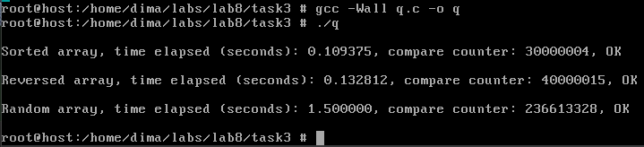

    Рисунок 12 - результат виконання

 

Потім ще додав масив з однаковими значеннями (рисунок 13).

    

    Рисунок 13 - результат виконання для масива з однаковими значеннями

 

Наприклад, для обраних даних (відсортовані, звортні, випадкові та однакові) бачимо, що однакові сортуюються максимально швидко, потім трохи більше відсортовані, потім зворотньо відсортовані, і найгірший результат показала послідовність випадкових чисел. Тут compare counters - це кількість викликів функції порівняння при сортуванні.

 

    Завдання 8.4
    Виконайте наступну програму на мові програмування С:
    int main() {
        int pid;
        pid = fork();
        printf("%d\n", pid);
    }
    Завершіть цю програму. Припускаючи, що виклик fork() був успішним,
    яким може бути результат виконання цієї програми?

Для початку дізнаємось інформацію про fork() (рисунок 14).

    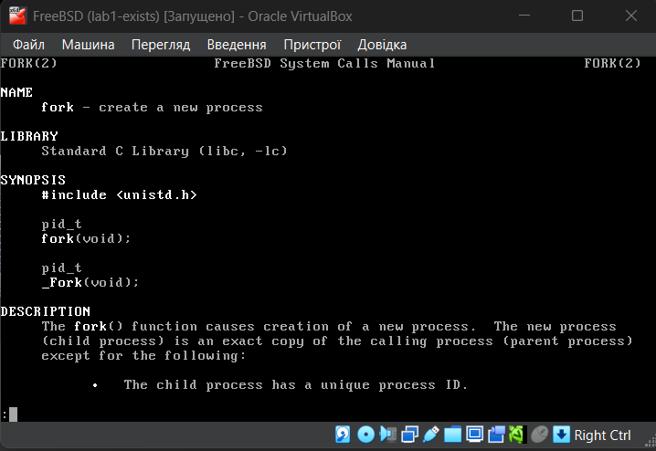

    Рисунок 14 - результат команди man fork

 

Ця функція, за описом, створює новий дочірній процес, який є копією поточного процесу, але з певними відмінностями (<a href="https://man7.org/linux/man-pages/man2/fork.2.html">https://man7.org/linux/man-pages/man2/fork.2.html</a>). Протестуємо код, трохи його дописавши (рисунок 15, 16).

    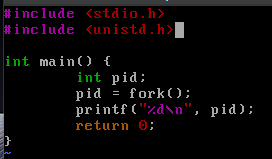

    Рисунок 15 - код програми

 

    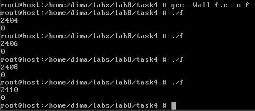

    Рисунок 16 - результати виконання

 

Насправді ще з документації було очевидно, що дочірній процес буде мати pid (process id) 0, а батьківський буде який завгодно, але тільки не нуль, у разі успішного виконання (рисунок 17).

    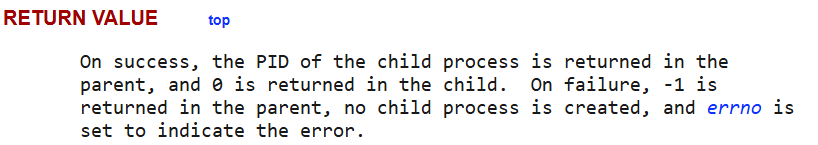

    Рисунок 17 - клон буде мати pid 0

 

 

## 
Варіант 5

 

> 5. Напишіть програму, яка симулює збій у середині операції write() і
спробуйте зберегти цілісність даних.

 

 Нагадаємо, що функція write записує дані у файл, посилаючись на файловий дескриптор. Для симуляції збою будемо мати якісь константні дані, які оголосимо, наприклад, через макроси, нехай це буде якийсь символьний масив, і циклом пройдемось по кожному байту, але в самому циклі, при певній умові, наприклад коли ітерація буде приблизно дорівнювати половині розміру масива, то будемо виходити з циклу і в такому випадку приблизно частина даних запишеться, а чистина - ні (рисунок 18).

    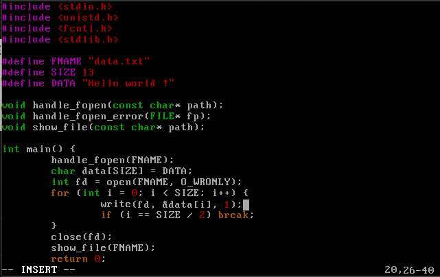

    Рисунок 18 - основний код програми

 

Я тут також написав додаткові функції для роботи з файлами (рисунок 19), handle_fopen - потрібний просто для того щоб очистити вміст файлу, якщо такий існує - це треба, щоб не було лишньої плутанини і нам нічого не заважало при записі до файлу через write(), handle_fopen_error - оброблює вказівник на файл при використанні функції fopen(), show_file - показує вміст файлу - це треба для перегляду результату одразу, щоб лишній раз не передивлятися вміст файлу через команду в терміналі (у мене це vim w.c, w.c - так назвав файл, а потім ще й виходити звідти чере :wq - це ж величезна морока).

    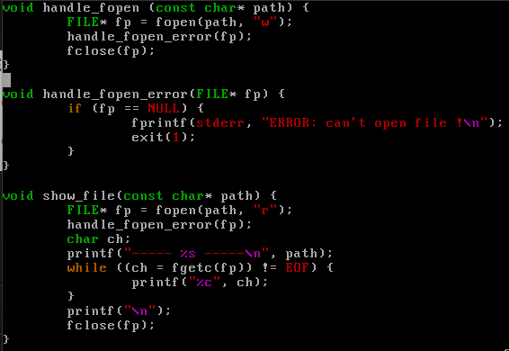

    Рисунок 19 - реалізація допоміжних функцій

 

Також, оскільки ми не можемо "влізти" в саму операцію write, зробимо її (цикл, де ми проходимось по всьому масиву) окремою функцією (рисунок 20)

    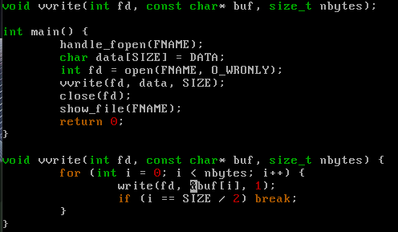

    Рисунок 20 - реалізація власного write

 

Тепер потрібен механізм, який би зміг забезпечити цілісність даних в такому випадку. В минулому семестрі з баз даних ми трохи розглядали транзакції. Думаю тут можна використати щось схоже. Тобто в кінці у файлі data.txt буде або повне повідомлення, або взагалі нічого. Наприклад, будемо створювати тимчасовий файл, виконувати для нього write, якщо порівняння вмісту початкових даних і вмісту цього файлу буде успішною, то виконуємо запис до основного файлу. Хоча транзакції і мають властивість атомарності, цей варіант буде мати таку властивість лише частково, оскільки, хоча й перший раз збою немає, це не означає що гарантовано його не буде другий раз, або якщо живлення вимкнеться в цей момент, певно є ще якісь проблеми, але це точно буде краще для збереження цілісності даних, ніж нічого не робити. Ще дуже гарним варіантом, після перенесення даних у тимчасовий файл і перевірку, буде просте перейменування тимчасового файлу у оригінал, і видалення оригінального файлу, але тут вже не можна гарантувати, що все інше піде по плану, наприклад, саме перейменування дасть збій. Зараз, все ж таки, мені здається що другий варіант кращий за перший, оскільки тут ми практично повністю забезпечуємо цілісність даних і вони або запишуться в повному обсязі, або взагалі їх не буде (рисунок 21, 22).

    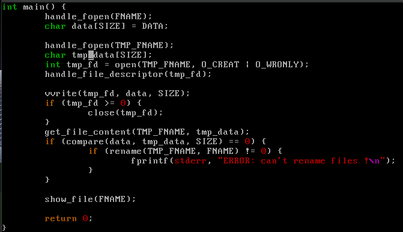

    Рисунок 21 - реалізація механізму для збереження цілісності даних

 

    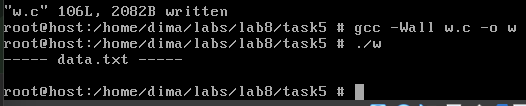

    Рисунок 22 - результат виконання

 

Як бачимо, файл пустий, оскільки write дав збій. Тепер приберемо break і запустимо процес (рисунок 23, 24).

    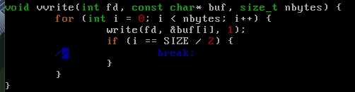

    Рисунок 23 - прибираємо break

 

    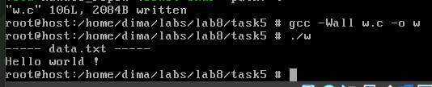

    Рисунок 24 - результат виконання

 

Як бачимо все працює. Чомусь в мене виникли проблеми з порівняннм strcmp, чомусь нуль-символ не добавлявся до рядка, ні автоматично, ні вручну, тому прийшлось писати власну функцію порівняння, яка приймає ще кількість байтів, які треба зіставити.

