

# 
Лабораторна робота №9

 

    Завдання 9.1
    Напишіть програму, яка читає файл /etc/passwd за допомогою команди getent
    passwd, щоб дізнатись, які облікові записи визначені на вашому комп’ютері.
    Програма повинна визначити, чи є серед них звичайні користувачі (ідентифікатори UID
    повинні бути більші за 500 або 1000, залежно від вашого дистрибутива), окрім вас.

Для початку виконаєму цю команду в терміналі (рисунок 1).

    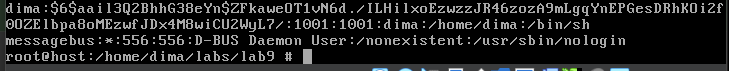

    Рисунок 1 - результат виконання getent passwd

 

Бачимо, що для звичайного користувача uid - 1001, тобто будемо фільтрувати uid > 1000l. У root uid - 0. Будемо зчитувати файл і розбивати рядки через strtok() (рисунок 2, 3). З результату виконання команди можна помітити, що id стоїть на другій позиції, якщо індексувати як в масиві. getuid() - допоможе отримати поточний ідентифікатор <a href="https://man7.org/linux/man-pages/man2/geteuid.2.html">https://man7.org/linux/man-pages/man2/geteuid.2.html</a>, в такому випадку будемо запускати програму зі звичайного користувача/

    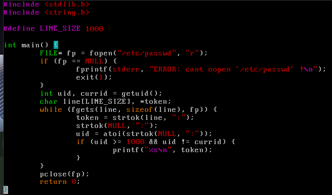

    Рисунок 2 - код програми

 

    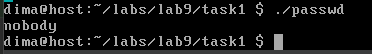

    Рисунок 3 - результат виконання 

 

Хто це: користувач з іменем nobody ?. <a href="https://wiki.ubuntu.com/nobody">https://wiki.ubuntu.com/nobody</a>. Тобто виходить, що користувач nobody — це спеціальний системний обліковий запис у Unix-подібних операційних системах, основне призначення якого — діяти як "пустий" або "анонімний" користувач з мінімальними правами доступу, що використовується для підвищення безпеки NFS серверів.

 

    Завдання 9.2
    Напишіть програму, яка виконує команду cat /etc/shadow від імені адміністратора,
    хоча запускається від звичайного користувача.
    (Ваша програма повинна робити необхідне, виходячи з того, що конфігурація системи
    дозволяє отримувати адміністративний доступ за допомогою відповідної команди.)

Тут використаємо функцію system(), яка виконує команду термінала <a href="https://man7.org/linux/man-pages/man3/system.3.html">https://man7.org/linux/man-pages/man3/system.3.html</a> (рисунок 4, 5).

    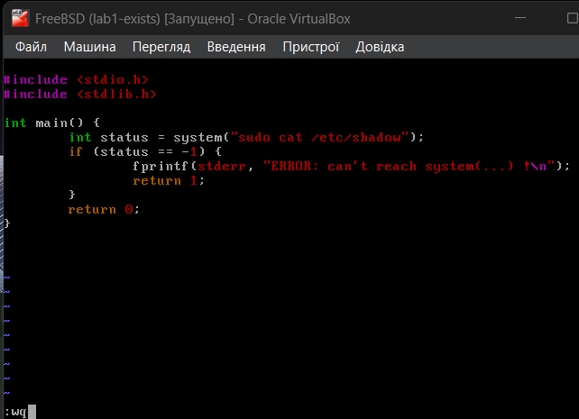

    Рисунок 4 - код програми

 

Тут ми користуємось командою sudo, для початку я встановив pkg install sudo, потім додав користувача до групи wheel за допомогою команди pw usermod dima -G wheel і змінив конфігураційний файл sudo через команду visudo, де розкоментував рядки, в яких члени групи sudo можуть виконувати будь які команди і тепер маємо наступний результат (рисунок 5).

    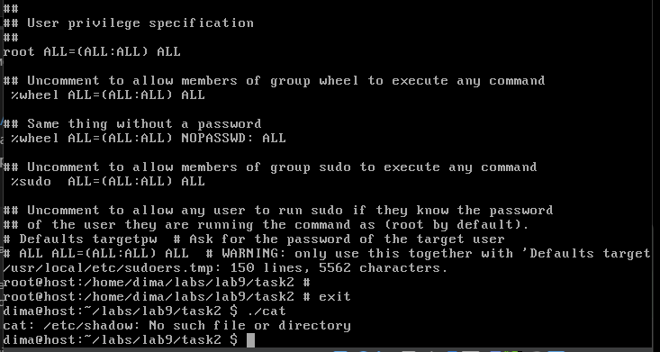

    Рисунок 5 - результат виконання

 

Як бачимо все працює, в результаті команда cat пише нам що такого файлу або папки не існує.

 

    Завдання 9.3
    Напишіть програму, яка від імені root копіює файл, який вона перед цим створила від
    імені звичайного користувача. Потім вона повинна помістити копію у домашній каталог
    звичайного користувача.
    Далі, використовуючи звичайний обліковий запис, програма намагається змінити файл
    і зберегти зміни. Що відбудеться?
    Після цього програма намагається видалити цей файл за допомогою команди rm. Що
    відбудеться?

Напишемо код згідно з завданням і перевіримо що станеться (рисунок 6, 7).

    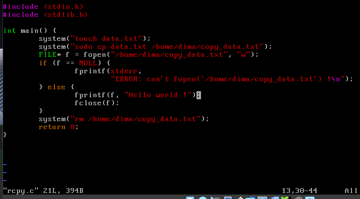

    Рисунок 6 - код програми

 

    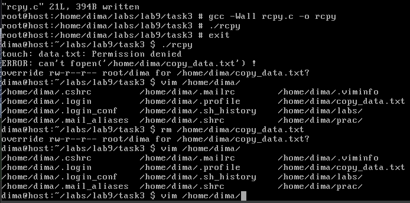

    Рисунок 7 - результат виконання

 

Як бачимо, у користувача з root-правами проблем ніяких немає, а ось звичайний користувач навіть не може створити файл. Але він може скопіювати його в домашній каталог звичайного користувача через sudo і, як можна побачити, він не може його видалити він імені звичайного користувача, причому змінити його теж не може, оскільки файл copy_data.txt виявився пустим.

 

    Завдання 9.4
    Напишіть програму, яка по черзі виконує команди whoami та id, щоб перевірити стан
    облікового запису користувача, від імені якого вона запущена.
    Є ймовірність, що команда id виведе список різних груп, до яких ви належите.
    Програма повинна це продемонструвати.

Напишемо код згідно з завданням: будемо по черзі виконувати команди whoami та id через system() та подивимось на результат (рисунок 8, 9).

    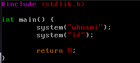

    Рисунок 8 - код програми

 

    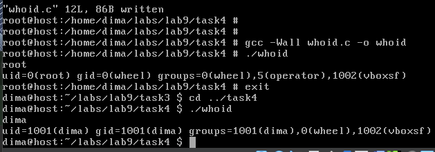

    Рисунок 9 - результат виконання

 

Видно, що команда id для звичайного користувача та для супекористувача виводитья декілька груп, до яких вони належать. У звичайного є основна група - dima. Та інші дві: wheel та vboxsf. У root-користувача є wheel, operator та vboxsf, перші дві - це групи, до яких я не додавав суперкористувача, він, наскільки я зрозумів, додавався до цих груп автоматично при створенні, wheel - це спеціальна група, яка дає користувачам права на виконання адміністративних команд, таких як доступ до root; група operator призначена для користувачів, які мають доступ до системних утиліт, що можуть змінювати певні налаштування системи. Звичайний користувач був доданий до групи wheel у другому завданні командою pw usermod dima -G wheel. Також тут є група vboxsf до якої належать і звичайний і root користувачі. Ті, хто належать до цієї групи можуть мати доступ до файлових систем, спільно наданих між хостом і віртуальною машиною. Декілька днів назад (може 3, 4) мені стало зрозуміло, що вручну переписувати код з віртуальної ОС на основну - це не дуже зручно, навіть з веб-сервісами, які можуть конвертувати зображення у текст, бо часто вони можуть це робити з помилками, та і довго це все, тому пішов дізнаватися як створити спільну папку, оскільки VirotulBox від Oracle надає таку можливість, там треба обрати папку на основній ОС, встановити гостьові доповнення у віртуальній ОС та змонтувати в ній точку - папку, яка буде "мостом". І для цього мені знадобилось встановити через pkg vboxsf (надає доступ до спільних папок і файлів у VirtualBox) і додати до нього користувачів, потім був написаний скрипт, який автоматизує це все діло (рисунок 10). Так набагато зручніше.

    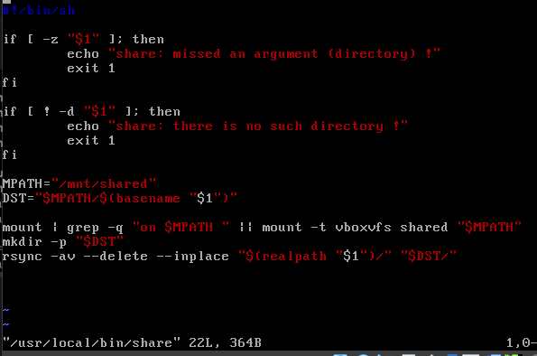

    Рисунок 10 - скрипт share

 

Оскільки кожний раз коли іде вхід у FreeBSD, потрібно кожний раз заново монтувати точку (тут використовується vboxvfs - це файловий драйвер, який забезпечує доступ до спільних папок, не плутати з vboxsf). Також у мене тут виникли проблеми з рекурсивним копіюванням файлів через cp -r, тому використовую програму rsync, яку попередньо встановив через пакетний менеджер. А знаходиться саме у /usr/local/bin, щоб можна було викликати скрипт в терміналі з будь-якого місця просто написавши share, який в якості аргументу приймає каталог, який ми хочемо копіювати.

 

    Завдання 9.5
    Напишіть програму, яка створює тимчасовий файл від імені звичайного користувача.
    Потім від імені суперкористувача використовує команди chown і chmod, щоб змінити
    тип володіння та права доступу.
    Програма повинна визначити, в яких випадках вона може виконувати читання та запис
    файлу, використовуючи свій обліковий запис.

Для перевірки наданих прави доступу для читання файлу або запису даних у файл, будемо використовувати функцію access(2) (<a href="https://man7.org/linux/man-pages/man2/access.2.html">https://man7.org/linux/man-pages/man2/access.2.html</a>) з бібліотеки unistd.h (рисунок 11).

    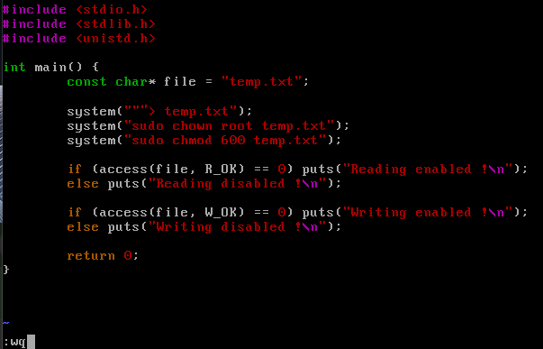

    Рисунок 11 - код програми

 

sudo chown root temp.txt - змінює власника файлу temp.txt на користувача root. chmod 600 temp.txt - встановлює права доступу до файлу temp.txt. 600 — це числовий режим доступу:
6 (для власника): це читання (4) + запис (2) = 6
0 (для групи): жодних прав
0 (для інших): жодних прав
Тобто тільки власник (тобто root) зможе читати і змінювати файл.

<a href="https://man7.org/linux/man-pages/man1/chown.1.html">https://man7.org/linux/man-pages/man1/chown.1.html</a> 
<a href="https://www.man7.org/linux/man-pages/man1/chmod.1.html">https://www.man7.org/linux/man-pages/man1/chmod.1.html</a>

    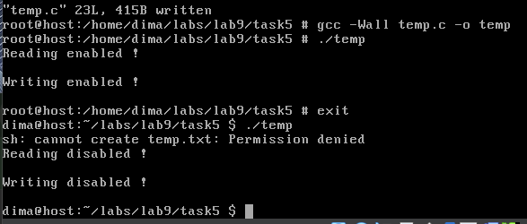

    Рисунок 12 - результат виконання

 

Як і в минулий раз, звичайний користувач не має права на запис і, відповідно, створення файлів, тому додам 'sudo', тобто ствоерння файлу буде іти від імені суперкористувача (рисунок 13, 14).

    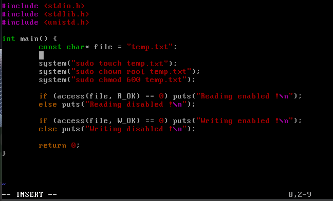

    Рисунок 13 - зміна параметра при першому виклику system

 

    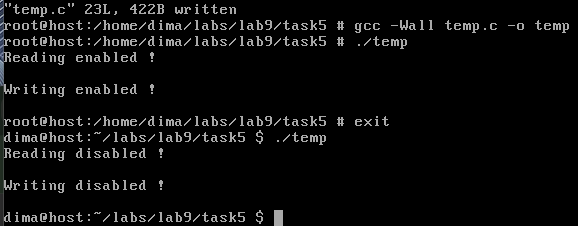

    Рисунок 14 - результат виконання

 

Тепер все нормально, останні виклики system() встановлюють власника root і дозволяє читання та запис тільки для root-користувача, саме тому перший раз ми маємо дозвіл access(), і другий раз від імені звичайного користувача - ні.
Чому так стається, що звичайний користувач не може створювати та записувати дані у файл, я не зміг розібратись, спочатку подивився вивід через ls -ld, директорія теж саме - не має прав, надав права через chmod, але з файлом так не виходить, бо він вже має існувати, тому є крайній випадок, коли надається повний дозвіл усім користувачам і групам (насправді необов'язково надавати усі права, достатньо надати права на запис) (рисунок 15).

    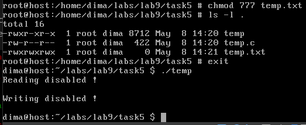

    Рисунок 15 - результат виконання (так як задумано, тобто без 'sudo' у першому system())

 

І да, тепер все працює, але проблема нікуди не ділася, оскільки ми надали такий доступ вже створеному файлу, а створюється він без прав доступу для звичайного користувача. Дізнався про маску створення файлів umask() (<a href="https://man7.org/linux/man-pages/man2/umask.2.html">https://man7.org/linux/man-pages/man2/umask.2.html</a>). Спробуємо її змінити (рисунок 16, 17).

    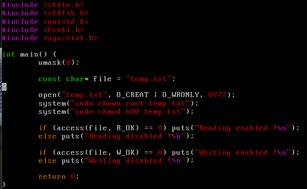

    Рисунок 16 - додавання маски

 

    

    Рисунок 17 - результат виконання

 

Начебто воно, але я перевірив права доступу (рисунок 18).

    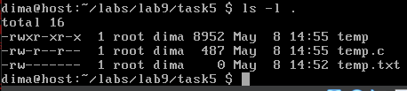

    Рисунок 18 - права доступу

 

Тобто нічого не змінилось, але тепер проблеми нема, тобто тут напіврішенням буде використання функції open() (рисунок 19, 20).

    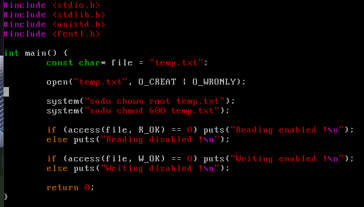

    Рисунок 19 - кінцевий код програми

 

    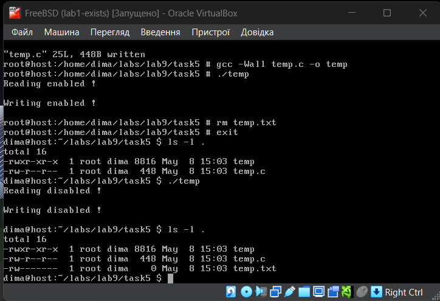

    Рисунок 20 - кінцевий результат виконання

 

 

    Завдання 9.6
    Напишіть програму, яка виконує команду ls -l, щоб переглянути власника і права
    доступу до файлів у своєму домашньому каталозі, в /usr/bin та в /etc.
    Продемонструйте, як ваша програма намагається обійти різні власники та права
    доступу користувачів, а також здійснює спроби читання, запису та виконання цих
    файлів.

Напишемо код згідно з завданням, в якому будемо викликати команду ls -l для трьох шляхів: /home, /etc, /usr/bin (рисунок 21, 22).

    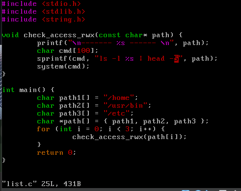

    Рисунок 21 - код програми

 

    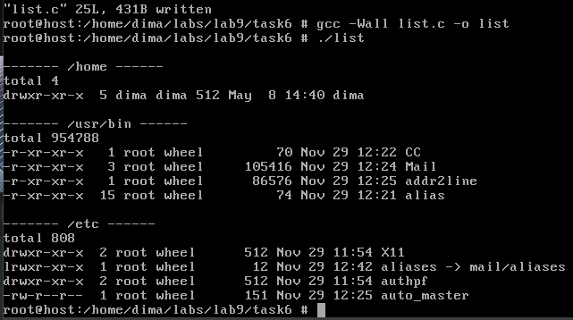

    Рисунок 22 - результат виконання

 

Кількість рядків для виводу було обмежено через head -n, бо без нього вивід був дуже довгим. Права доступу на читання, запис та виконання цих файлів можна побачити з рисунку (рисунок 22). Тут зліва, де іде вивід по типу --rw-r--r--, r - право на читання, w - право на запис до файлу, x - право на виконання, d - означає, що це директорія, l - символічне посилання, знак мінуса '-' - означає відсутність права. Всього три групи: перша - власник файлу, друга - група, третя - інші користувачі. Спочатку мені здавалося, що власинк - це тільки суперкористувач, але потім стало зрозуміло, що це не так, оскільки користувач з root-правами завжди може робити з файлами що захоче, незалежно від rwx.

 

 

## 
Варіант 5

 

    Змоделюйте ситуацію, де користувач має лише права на запис до файлу, але не
    може його прочитати. Як це можливо, і які наслідки для безпеки або роботи
    програм?

 

Будемо моделювати зі сторони звичайного користувача з використанням sudo (для створення файлу та зміни режиму) (рисунок 23).

 

    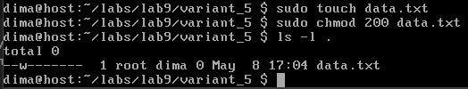

    Рисунок 23 - моделювання ситуації

 

На мою думку, поки що, такі налаштування обмежують роботу програм і можуть призвести до збоїв у функціонуванні системи чи додатків, які повинні читати та записувати дані в файли, проте є і деякі переваги, наприклад, <a href="https://superuser.com/questions/586209/write-but-not-read-permission-on-a-file-in-linux">superuser.com/questions/586209</a>. Тут кажуть, що це може бути корисним у випадку, коли процеси під кількома обліковими записами записують в один файл журналу, але процес, що належить одному користувачеві, не повинен мати можливість читати (імовірно конфіденційні) записи журналу процесу, що належить іншому користувачеві.

